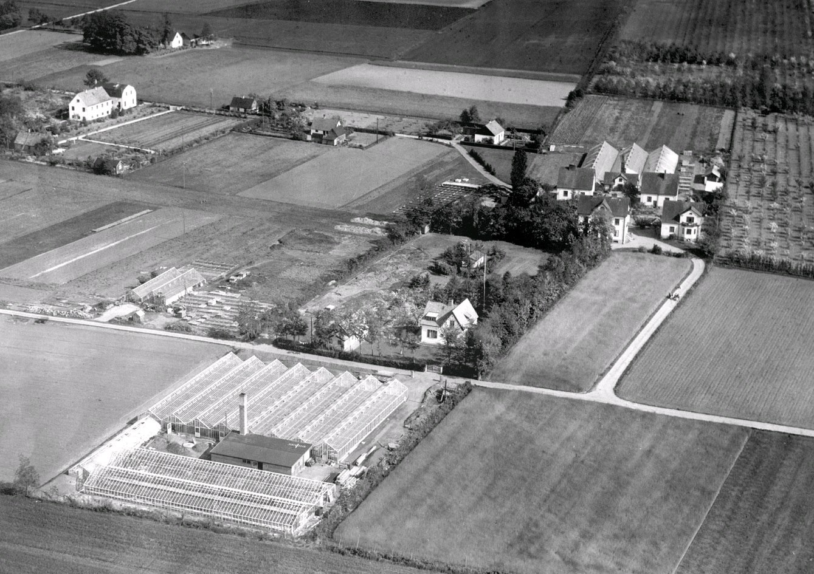

# Beatenborg

**Beatenborg** var en [[bostad]] i [[Bjerehof]] en gång tillhörande [[Walter Reeder]] och döpt efter hans dotter [[Beata]].

Beatenborg ligger längst av husen ner på bilden, nära växthusen.
