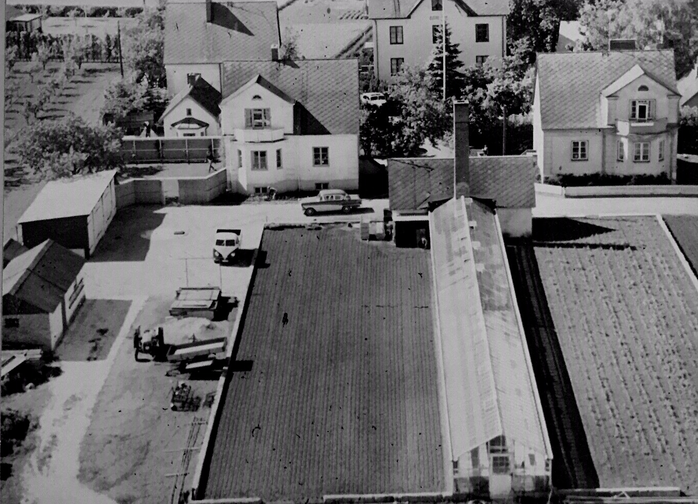
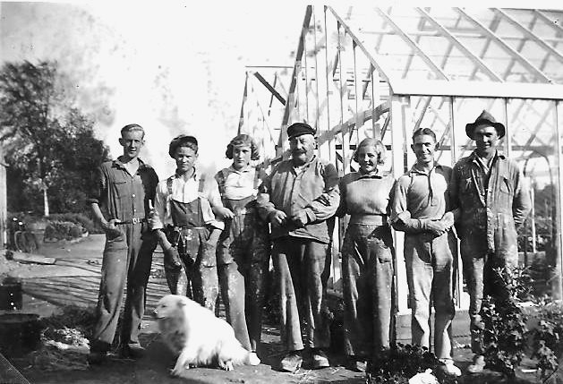

# Bjerehof

**Bjerehof**, ibland **Bjere Hof** eller "[Kristinas lilla by](Kristinas%20lilla%20by)", är ett [område](område) i [Bjärred](Bjärred). Området är numera del av ett större område vid namn [Bjärehov](Bjärehov). Genom Bjerehof går vägen [Bjeres väg](Bjeres%20väg).

Det var [Per Albert Pettersson](Per%20Albert%20Pettersson) och [Kristina Pettersson](Kristina%20Pettersson) som [1916](1916) köpte marken Flädie 22,106 + 145 – 150 av Per Bengtsson och Elna Persdotter. De hade en dröm om att bygga en liten by på landet som skulle vara självförsörjande, med affärer och hantverkare. De hade haft en fastighet som hade brunnit ner, och använde försäkringspengarna till att förverkliga drömmen. Kristina flyttade hit 1918 till ett äldre hus på tomten. Mellan 1929 - 31 registrerade hon ett trevåningshus som fick namnet ”Bjere Hof” och tre tvåvåningshus samt två ekonomibyggnader. Pengarna tog slut och hon fick hyra ut ekonomibyggnaderna som sommarstugor, senare som åretruntbostäder. Här har funnits [Speceriaffär](Speceriaffär), [Bageri](Bageri), [Slakteri](Slakteri), [Trädgårdsmästeri](Trädgårdsmästeri), [Gräddbullsfabrik](Gräddbullsfabrik), och [Keramikverkstad](Keramikverkstad).

Ekonomin blev ansträngd och så småningom såldes de tre stora husen plus all mark till [Walter Reeder](Walter%20Reeder), som hade trädgårdsmästeriet vars växthus syns längst ner på flygbilden. Han bodde i villan ovanför växthusen (se bild nedan). Den hette [Beatenborg](Beatenborg) efter dottern Beata. Det stora huset längst ner till höger köptes av en bagare.

[Handelsträdgården](Handelsträdgården) på Bjerehof startades upp av Kristina Pettersson som arrenderade ut den.

Stig och hustrun Göta flyttade in på andra våningen i det sydöstra huset. Då fanns det ett bageri på nedre våningen med bakugnar i källaren. <!-- TODO: Informationen finns dupliceras i Bjeres väg 20 -->

Fastigheten blev senare uppstyckad i fyra tomter som ligger i korsningen Näktergalsvägen-Västanvägen. Den nordvästliga delen av korsningen köpte Göta efter Stigs död 1987.

## Adresser

* [Bjeres väg](Bjeres%20väg)
  * [Bjeres väg 16](Bjeres%20väg%2016)
  * [Bjeres väg 18](Bjeres%20väg%2018)
  * [Bjeres väg 20](Bjeres%20väg%2020)

## Bilder

Bjere Hof på 1950-talet. Längst upp till vänster Stina och Helge Nilssons gård. Nedanför detta snickare Andreassons hus. Till höger därefter Sellergrens och Allan Ahlbergs hus. I nästa hus bodde Einar Olsson. I mitten finns det ursprungliga ”Bjerehof” med Anderssons trädgårdsmästeri med tre växthus och ekonomibyggnaden. Hitom detta ligger de två villorna med det stora bostadshuset framför och ytterligare en villa. Närmast ligger Reeders villa med drivhusen nedanför. Drivhusen till vänster tillhör Bloms Trädgårdsmästeri

[Oskar Andersson](Oskar%20Andersson) i mitten med sitt arbetslag. Lån av Göta Andersson.

Växthuset. Bild från [Göta Andersson](Göta%20Andersson).

## Källor

* <https://filer.hembygd.se/lomma/uploads/files/2020/08/01/Fl%C3%A4die%2022%20-%20Bjerehof%20.pdf> ([lokal kopia](file://sources/Flädie_22_Bjerehof.pdf)) <!-- TODO: Fix link -->
* Delar av texten sammanställt av Birgitta Nilsson.

## Referenser till denna artikel

* [Beatenborg](Beatenborg)
* [Bjeres väg 16](Bjeres%20väg%2016)
* [Bjeres väg](Bjeres%20väg)
* [Flädie 15,7](Flädie%2015,7)
* [Gyllins ängar](Gyllins%20ängar)
* [Göta Andersson](Göta%20Andersson)
* [Handelsträdgården](Handelsträdgården)
* [Högsäters frukodling](Högsäters%20frukodling)
* [Kristina Pettersson](Kristina%20Pettersson)
* [Kristinas lilla by](Kristinas%20lilla%20by)
* [README](README)
* [Stig Andersson](Stig%20Andersson)
