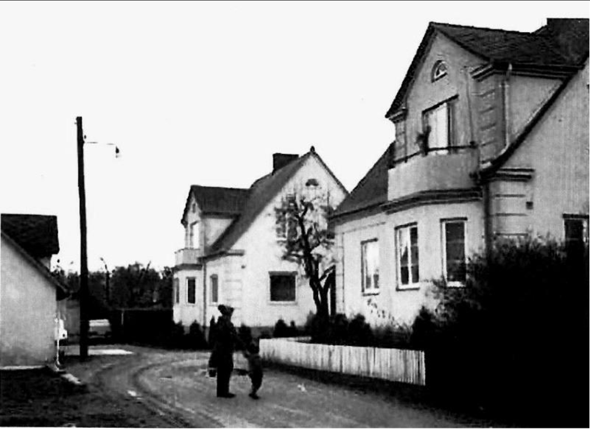

# Bjeres väg 20

**Bjeres väg 20** är en [[adress]] på [[Bjeres väg]]. Se även [[Fläde 22,195]] och [[Trädgårdsmästarens hus]]. Huset byggdes [[1931]].

[[Stig Andersson]] och hustrun [[Göta Andersson]] flyttade in på andra våningen i det sydöstra huset (Bjeres väg 20) runt år [[1945]]. Då fanns det ett [[bageri]] på nedre våningen med bakugnar i källaren.

[[Trädgårdsmästarens hus]] på Bjeres väg på [[1960]]-talet.
