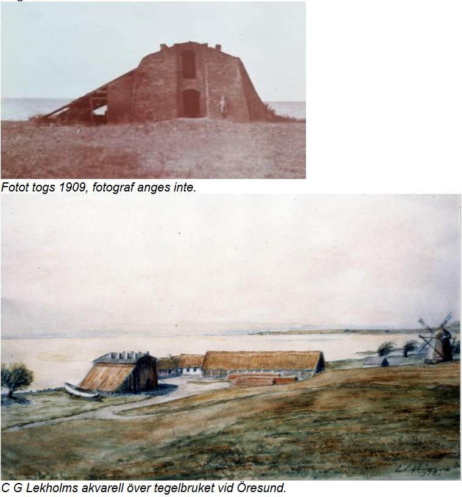

# Bjersunds tegelbruk

**Bjersunds tegelbruk** var ett [tegelbruk](tegelbruk) i [Bjärred](bjärred).

Mantalslängden för [1860](1860) nämns för första gången att det finns ett tegelbruk på Flädie nr 11. Ägare var Per Hansson (1821 – 1900), som arrenderade gården Flädie nr 11. Tegel bör alltså ha börjat produceras då.

Näste arrendator – Hans Nilsson (1839 - 1906) – står år 1900 som tegelbruksägare.

Det lades ner år [1887](1887).

Tegelbruket förstördes i julstormen [1902](1902) (natten mellan den 25 och 26 december). Varken tegelmästare eller tegelarbetare bodde på Flädie 11 enligt husförhörs-längderna

Vid tegelbruket låg [Kolabryggan](kolabryggan).

## Bilder

## Källor

* <https://filer.hembygd.se/lomma/uploads/files/2021/02/06/Teglbruket%20Fl%C3%A4die%2011.pdf>

## Referenser till denna artikel
- [1860](1860)
- [1887](1887)
- [1902](1902)
- [Kolabryggan](kolabryggan)
