# Bjärreds saltsjöbad

**Bjärreds saltsjöbad** var en badanläggning vid [havet](havet) i [Bjärred](bjärred) som uppfördes år [1901](1901) i samband med öppning av [Bjärreds järnvägsstation](bjärreds%20järnvägsstation). Arkitekten var domkyrkoarkitekten [Theodor Wåhlin](theodor%20wåhlin). I samband med öppning planterades 50 000 (5000?) träd.

## Anläggningen

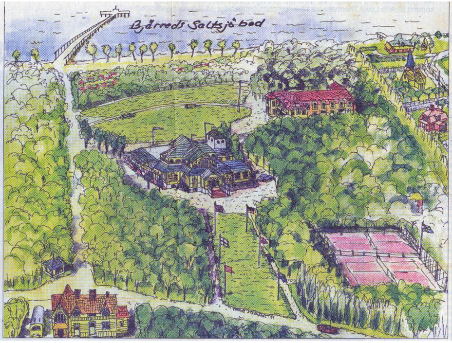

* En lång [brygga](brygga) ([Långa bryggan](långa%20bryggan))
* [badhotellet](badhotellet) (finare)
* [turisthotellet](turisthotellet) (lite enklare)
* [Restaurangen vid Bjärreds saltsjöbad](restaurangen%20vid%20bjärreds%20saltsjöbad)
* [brunnkios](brunnkios)
* [kägelbanor](kägelbanor)
* [tennisbanor](tennisbanor)

## Bakgrund

Bjärreds saltsjöbad kom att byggas år [1901](1901). Men även innan dess bar Bjärred en badort.

### Tidgare badhus

Enligt annons i Folkets Tidning badade Lundaborna redan [1853](1853) i Bjärred.

> 24/6
> Det nya badhuset i Bjerred som består av 7 rum för damer och 7 rum för herrar håller öppet varje vardag från kl 8 på morgonen till kl 10 på kvällen. 2 bussar går varje dag från Alidemsro föreningen kl 9 f.m och kl 4 em.

Anläggningen låg i slutet av [Pilevägen](pilevägen). Längst ut på bryggan fanns ett enkelt badhus i form av ett T, med badhytter för herrar till höger och damer till vänster. Här fanns också en dansbana, karusell, försäljningsstånd, restaurang och bersåer där man kunde inta förtäring. De som drev badanläggningen var Christina Westergren, Sven Persson, Jöns Svensson och Anders Jönsson.

### Andra badbryggor

Där fanns även andra badbryggor i Bjärred, så som [Kolabryggan](kolabryggan).

[Anna Kockum](anna%20kockum) minns att där vid stranden fanns en ca 30 meter lång båtbrygga och en bra bit längre ut stod ett badhus på pålar. En fiskare vid namn Claus brukade ro ut barnen Kockum till badhuset och sedan låg han och sov i båten medan de badade.

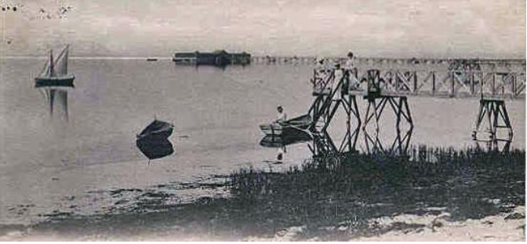

År [1922](1922) bygdes [Lycksalighetens ö](lycksalighetens%20ö).

## Bilder

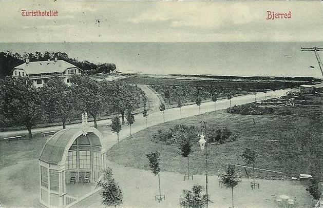
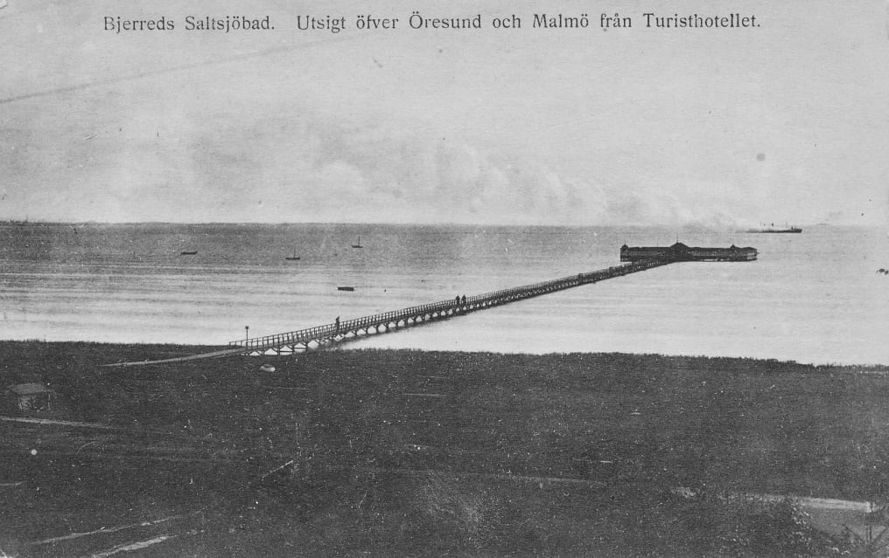

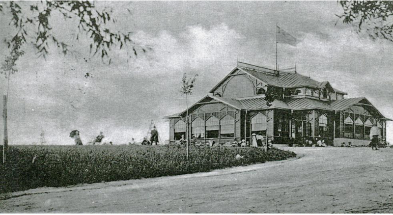
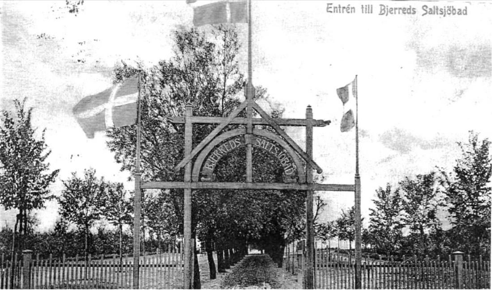
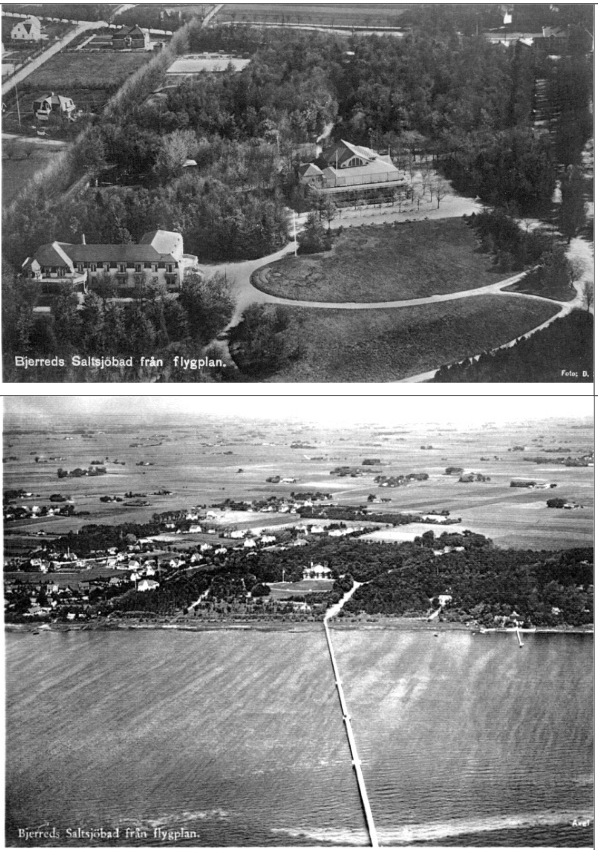
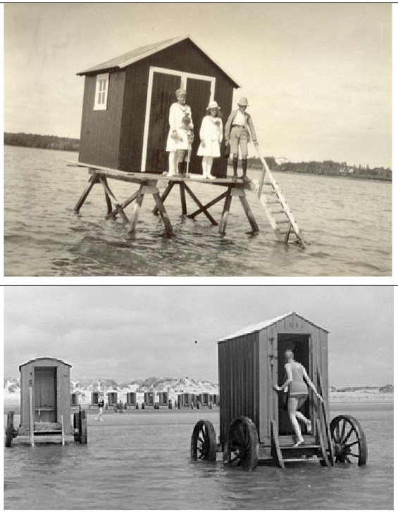
Badvagnar

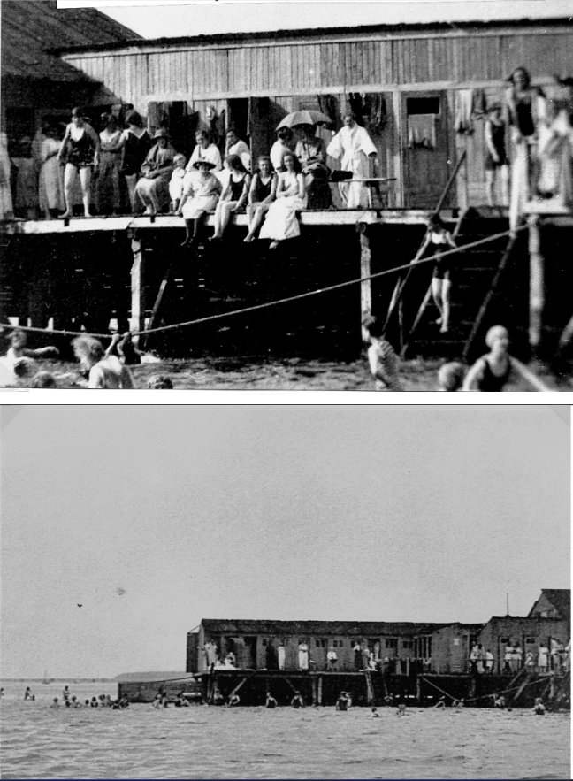
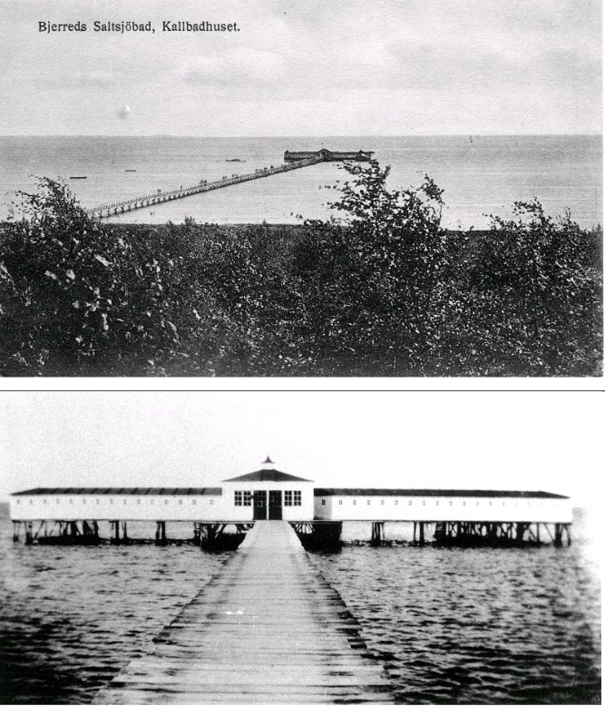
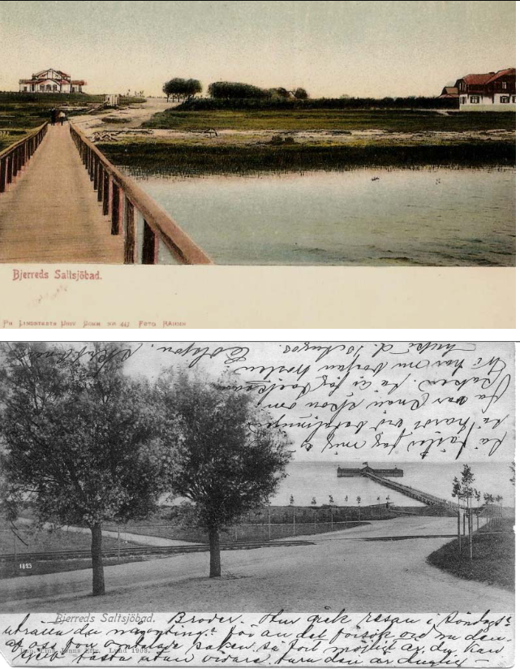
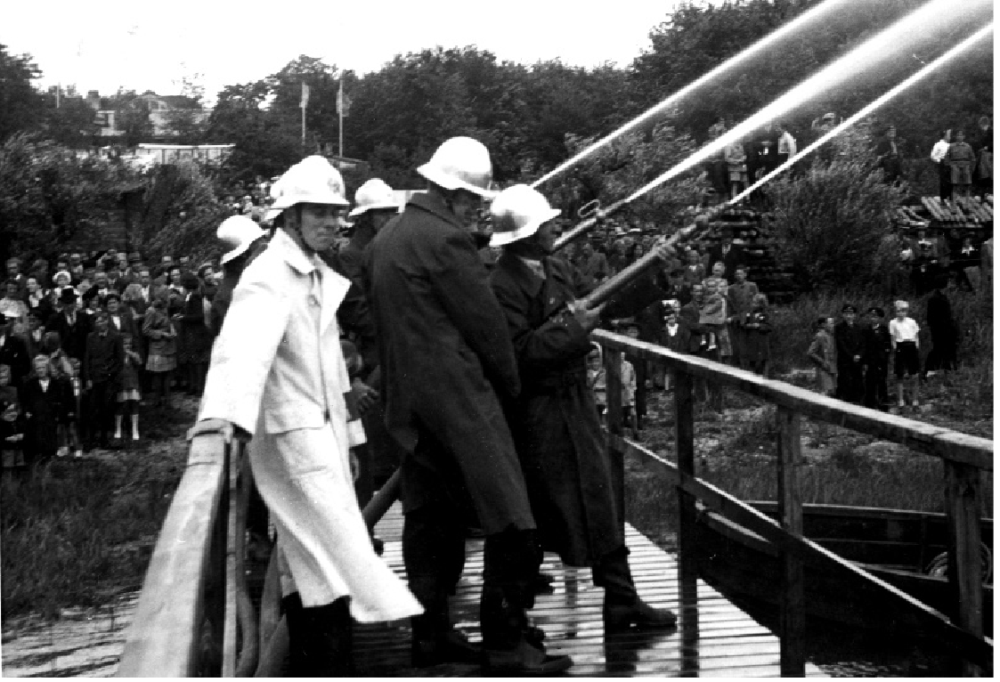
Brandkårsuppvisning/brandkårsfesten [1942](1942).

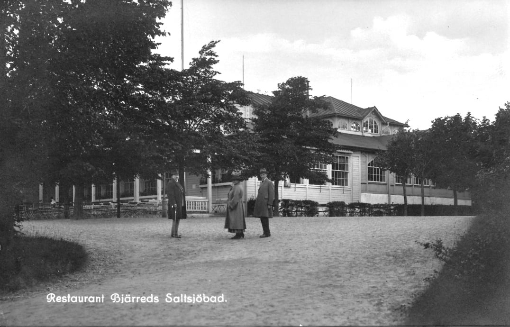
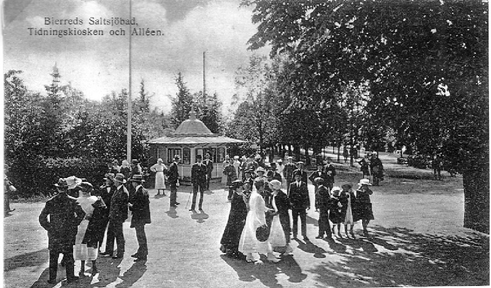
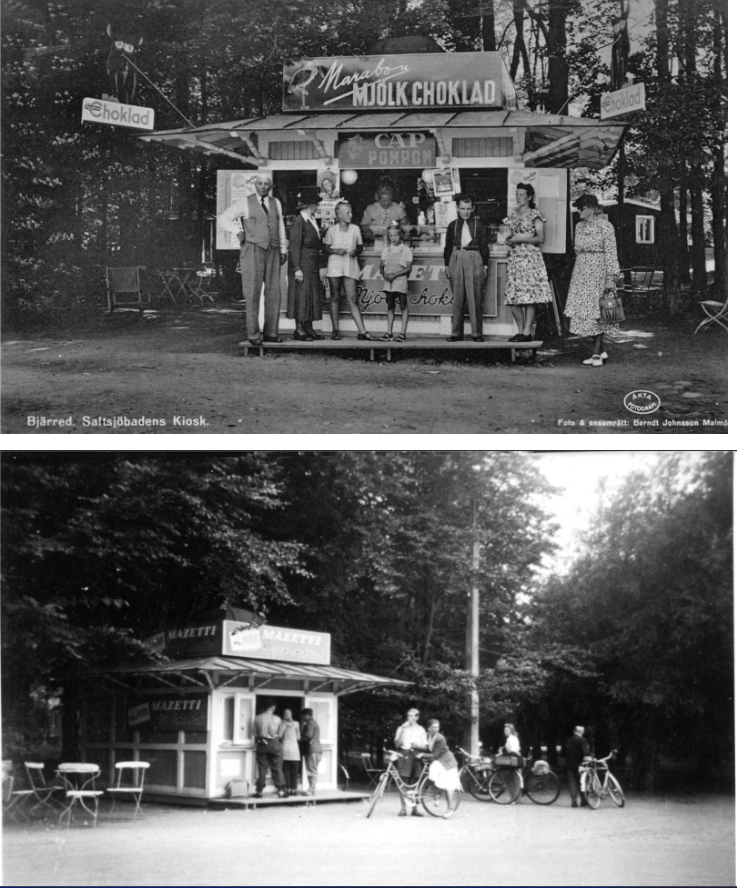

## Källor

* <https://filer.hembygd.se/lomma/uploads/files/2020/06/07/Fl%C3%A4die%2024%20Saltsj%C3%B6baden%20park%20o%20kalbadhus.pdf>
