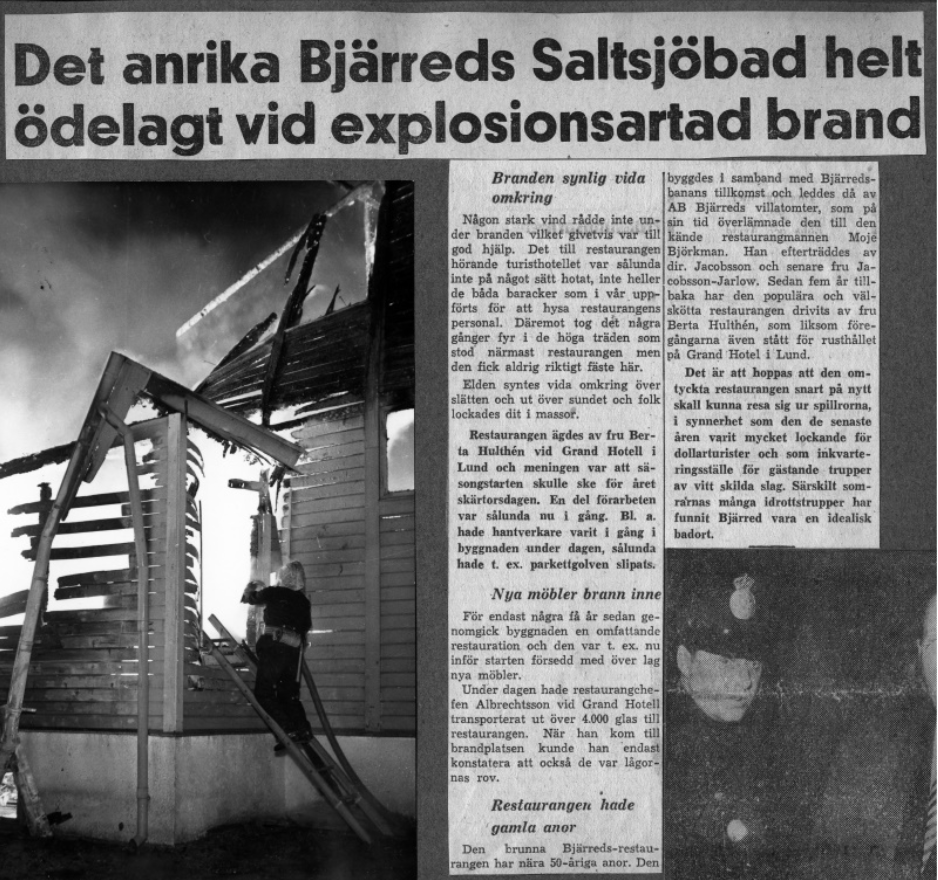
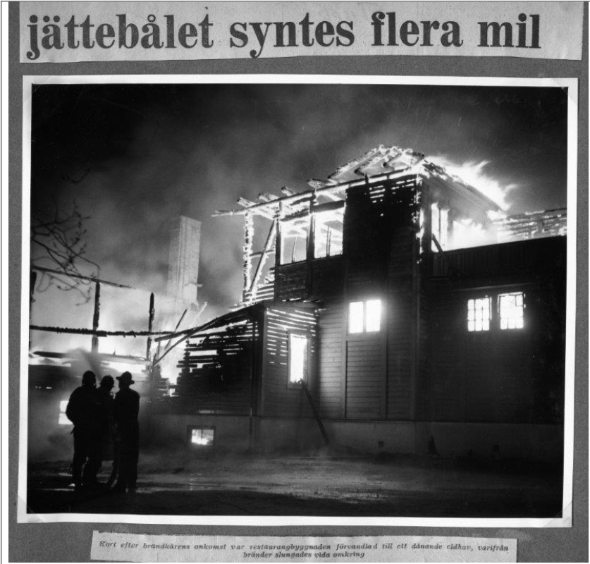
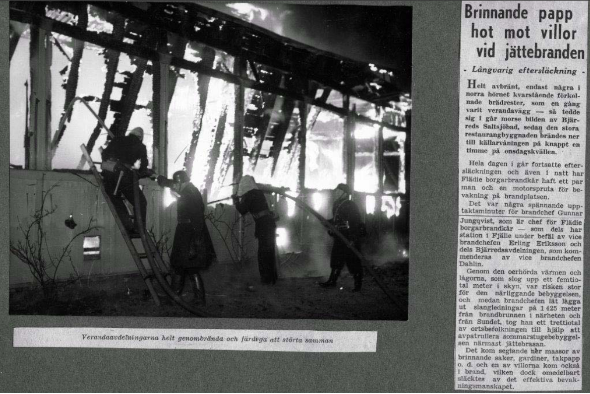
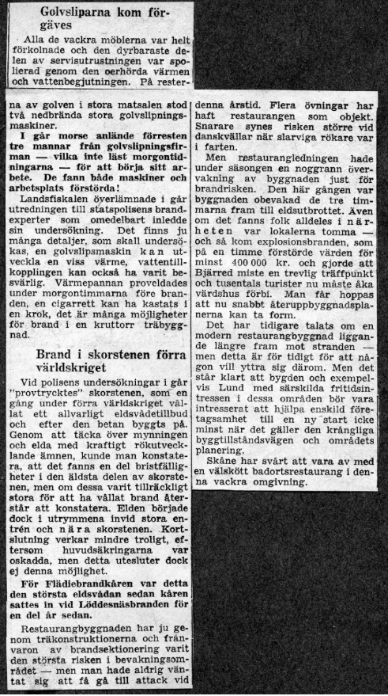
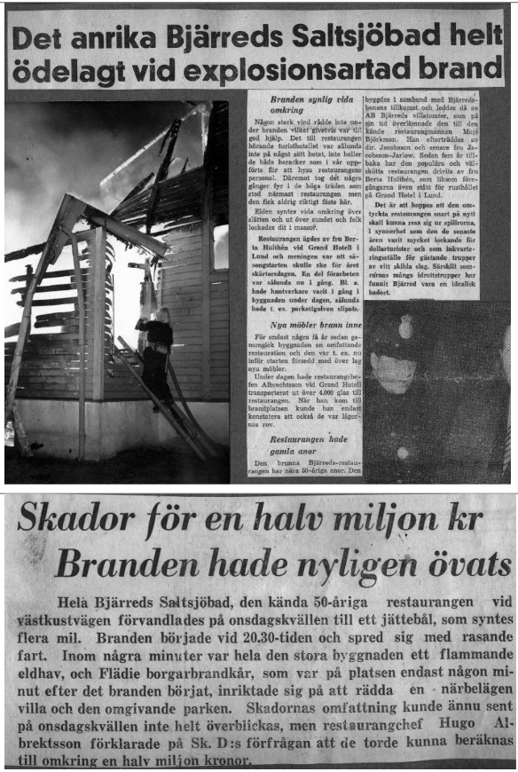
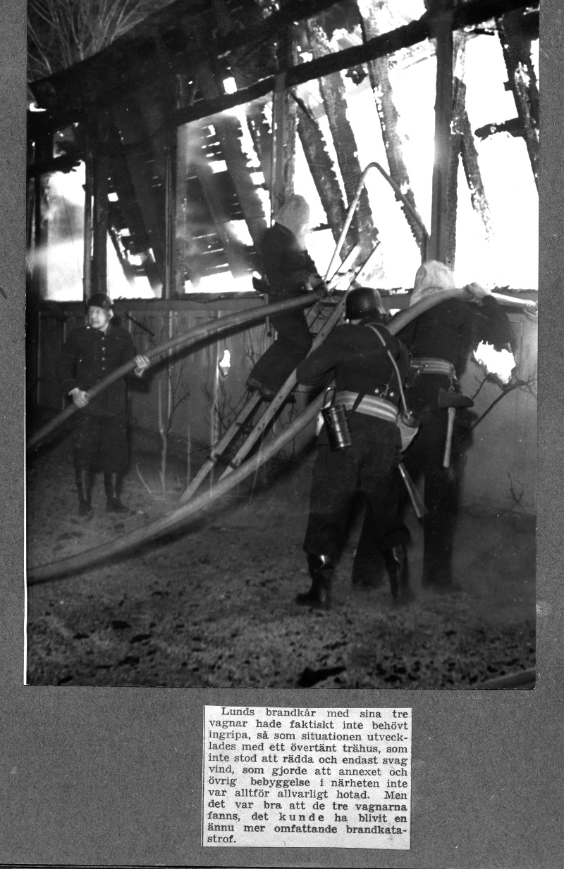
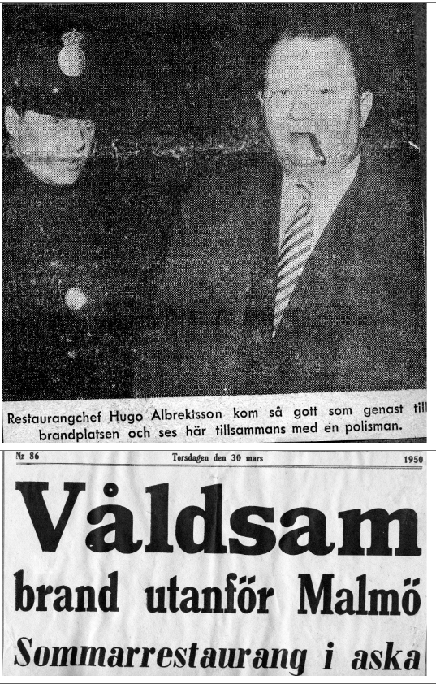
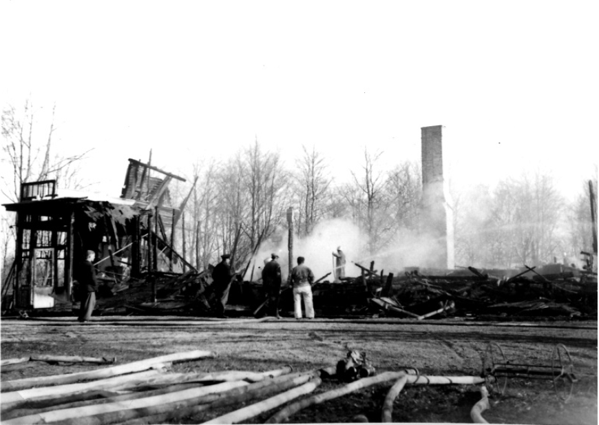
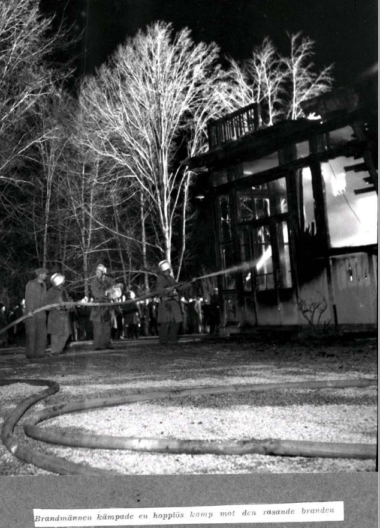
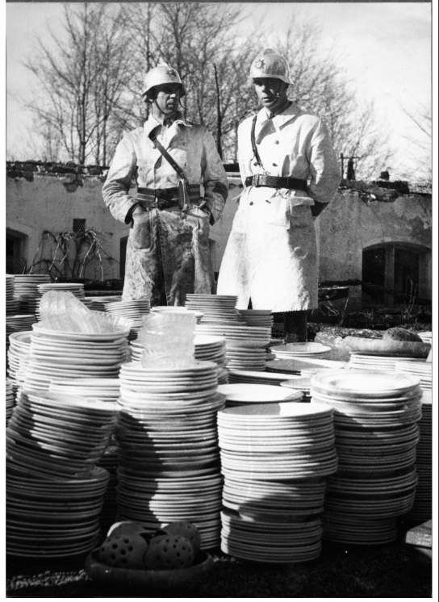

# Branden i Bjärreds saltsjöbad

**Branden i Bjärreds saltsjöbad** var en [brand](brand) som inträffade i [Bjärreds saltsjöbad](bjärreds%20saltsjöbad). Här fick [brandkår](brandkår) dyka upp för att släcka branden.

## Bilder

Vice-brandchef Dahlin och Brandchef Jungquist med tallrikar som räddades efter branden.

## Källor

* <https://filer.hembygd.se/lomma/uploads/files/2020/06/07/Fl%C3%A4die%2024%20Bj%C3%A4rreds%20Saltsj%C3%B6bad%20branden.pdf>
