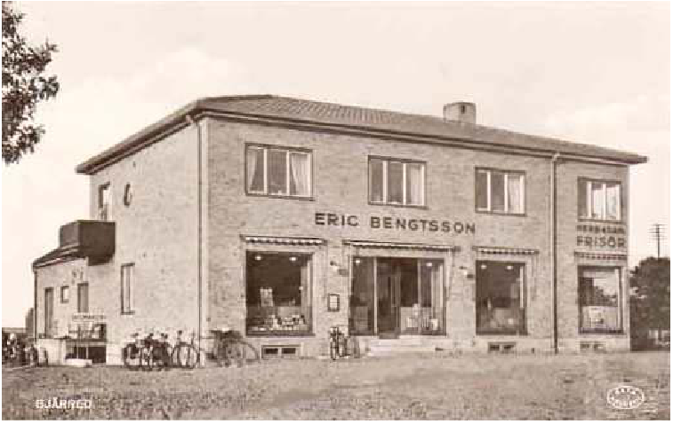

# Erik Bengtssons affär

**Erik Bengtssons affär** låg i [Gamla centrum](Gamla%20centrum).

[Erik Bengtsson](Erik%20Bengtsson) tog [1934](1934) över [Mathilda Rolofssons affär](Mathilda%20Rolofssons%20affär) på [Lundavägen](Lundavägen) ([Flädie 27,51](Flädie%2027,51)) i
höjd med Hägervägen. Det var en enplans lada à la Långa Längan. Ingers mor handlade där. Affären kallade för ”Bengtssons på backen”. Inger åkte med mamma för att handla och drogs då i en spjälvagn. ”Åka pelavagnen” kallade Inger det för. Mathilda avled 1946 på Flädie 22:141.

Specerihandlare Erik Bengtsson och hans hustru Asta f. Jeppsson byggde en ny affär som öppnades i mars [1940](1940). Deras barn hette Anna och Lars.

År 1939 sammanslogs 11:133 + 134 till 11:264. Fastigheten ligger i hörnet Lundavägen 1/Norra Västkustvägen 2 (11:133 - 134) där det nu är kemtvätt. På baksidan fanns ett hus med stenmangel. Edith Larsson berättar att det var en pampig affär med hans namn och "Speceri-, Manufaktur- & Diverseaffär'" över hela fasaden, och godisautomat utanför.

Det var ett omtyckt söndagseftermiddagsnöje att få en slant och cykla dit och "sticka" något gott, om än ibland lite medfaret av tid och solsken. [Hugo Magnusson](Hugo%20Magnusson) hade sin salong här innan han byggde huset på Tallvägen och Hartvig Andersson hade skomakeri i källaren. Affären övertogs av Åke och Maj-Britt Nilsson, som senare hade ICA Vikingen.

Byggnaden har idag (2024) en [kemtvätt](kemtvätt) och ligger intill en livsmedelsbutik.

## Bilder

