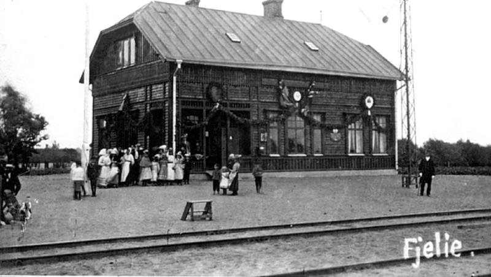
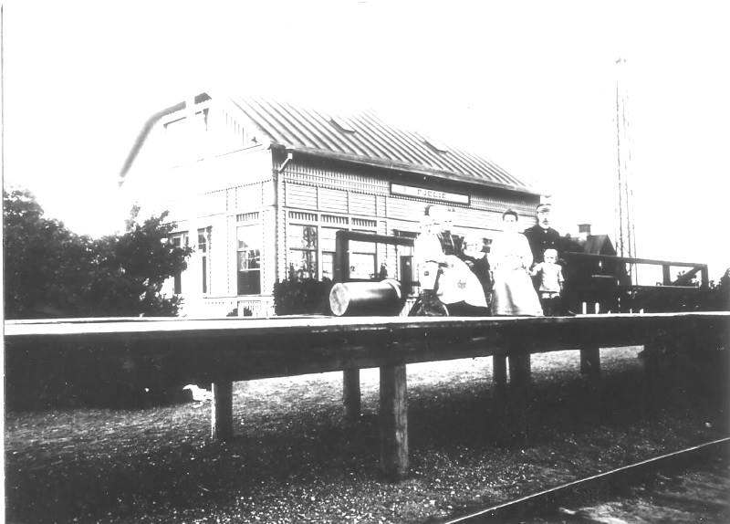
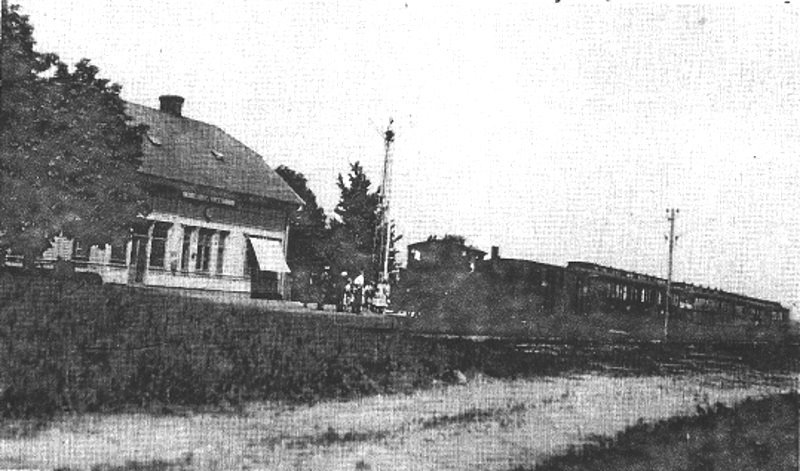
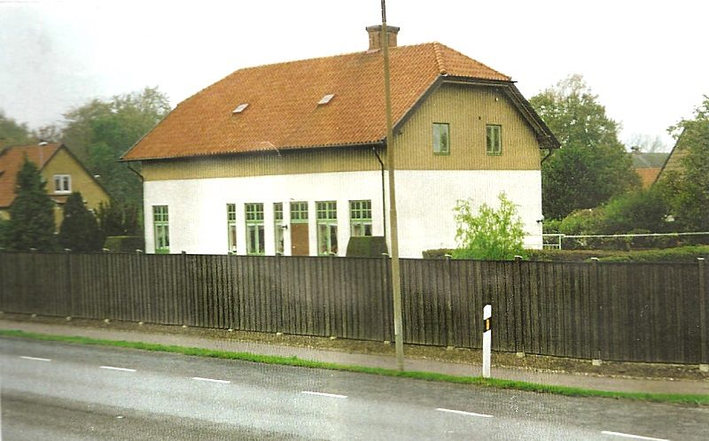

# Fjelie station

**Fjelie station** var en [[järnvägsstation]] i [[Fjelie]].  Den låg på [[järnväg]]en som sköttes av [[Bjärred-Lund-Harlösa Järnvägar]]. Stationen fanns mellan [[1901]] och [[1939]].

1939-[[1960]] var den arbetarbostad till anställda på ”Vindfällegård”.

## Bilder

Fjelie 15,10 Fjelie Vindfälleväg 15. Fjelie Station ”Festklädd”, kanske vid invigningen 1901.. Lån av Benny Nilsson Löddesnäs

Fjelie 15,10 Fjelie Vindfälleväg 15 Fjelie station omkring 1912. Stationsmästare Carl Sjögren med frun Anna och barnen: Erik, Kristina, Ester och Axel. Lån av Knut Persson Fjelie.

Fjelie 15,10 [[Fjelie Vindfälleväg 15]]. Badtåg på Fjelie station på [[1920]]-talet. Lån av Lomma Kommunarkiv.

Fjelie 15,10 Fjelie Vindfälleväg 15. Lån av Lomma Kommunarkiv.

## Källor

* <https://www.facebook.com/groups/329822347104603/posts/2074497442637076/>
