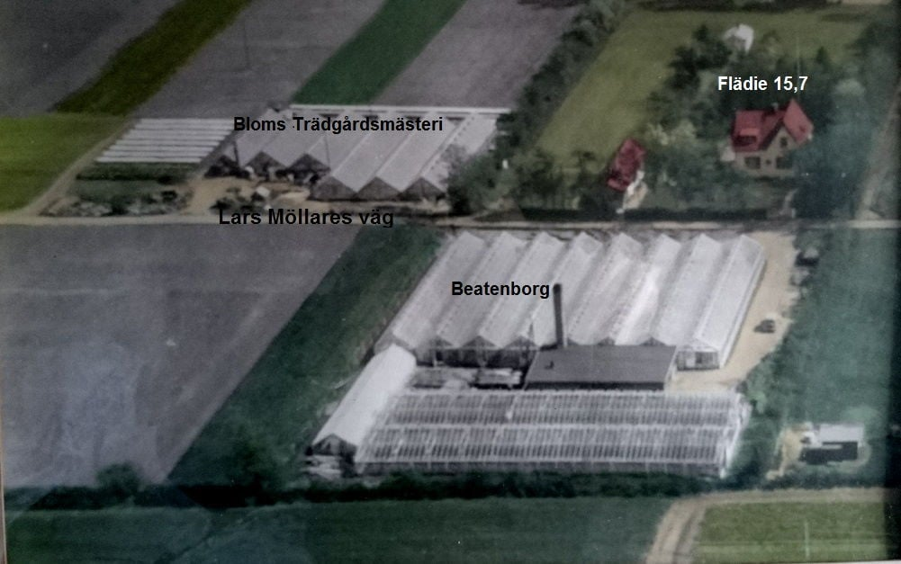

# Flädie 15,7

**Flädie 15,7** var en [tomt](tomt.md) i [Bjärred](Bjärred.md) i området [Bjerehof](Bjerehof.md). Den ägdes vid ett tillfälle av [Lars Andersson](Lars%20Andersson.md) och [Karna Nilsdotter](Karna%20Nilsdotter.md). Denna tomt låg också nära [Beatenborg](Beatenborg.md).

## Bilder

