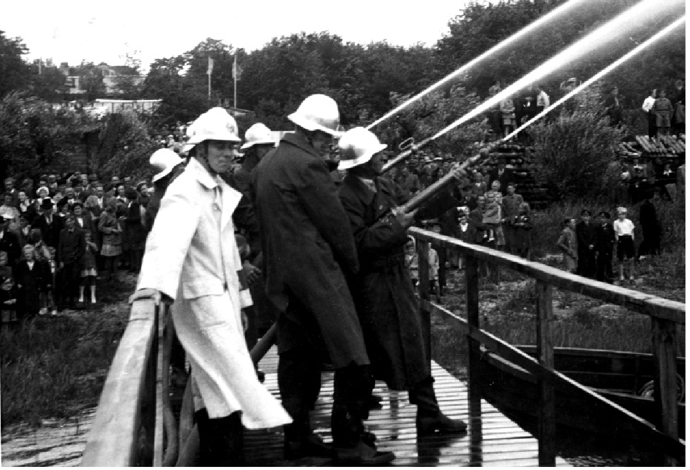

# Flädie Borgarbrandkår

**Flädie Borgarbrandkår** var en [brandkår](brandkår.md) i [Bjärred](Bjärred.md). Brandkåren hette från början _Flädie borgarbrandkår_ men ombildades [1943](1943.md) till [Flädie-Borgeby Frivilliga Brandkår](Flädie-Borgeby Frivilliga Brandkår.md). Brandkåren var stationerad på [brandstationen i Bjärred](brandstationen i Bjärred.md).

* [Flädie Borgarbrandkår](#flädie-borgarbrandkår)
  * [Flädie-Borgeby Frivilliga Brandkår på 1940-talet](#flädie-borgeby-frivilliga-brandkår-på-1940-talet)
  * [Flädie Borgarbrandkår på 1950-talet](#flädie-borgarbrandkår-på-1950-talet)
  * [Bilder](#bilder)
  * [Se även](#se-även)
  * [Källor](#källor)

## Flädie-Borgeby Frivilliga Brandkår på 1940-talet

Foton och Klipp är från [Gunnar Jungquist](Gunnar Jungquist.md)s album och lån av dottern Ann-Marie Ohlin, samt från Benny Nilssons arkiv och med tillstånd för publicering.

Innan Brandkåren organiserades och nybildades till Flädie-Borgeby Frivilliga Brandkår 1942, hade dåvarande Kommunalordförande Karl Olsson en brandspruta inne på logen på sin gård. Det blev snabba utryckningar och med hjälp av gårdens arbetare och frivilliga som uppbådades, blev eldsvådorna släckta. Det förekom många bränder. En eldsvåda var det 1935 på Hans Jonas väg på Nils Rasmussons gård och på Ekehem som då ägdes av Axel Jönsson. En stor brand inträffade 1914 vid världskrigets utbrott. Då slog blixten ner i Hans Nilssons Arrendegård Flädie Nr 11. Senare byggde Apotekare Montelin två byggnader och en park  på platsen. Här finns nu Bergagården och Kyrkan.  

I den nya  Brandkåren var Ingenjör Gunnar Jungquist Brandchef, Vicebrandchef var Målarmästare Ragnar Dahlin. Manskapet var en ordinarie utryckningsenhet med 10 man. Dessa var Nils Persson, Axel Persson, Albert Jönsson, Erik Larsson,  Arthur Andersson,  Hartvig Andersson, Hans Gunnar Skog, Albin Persson och Waldemar Jeppsson. Dessutom hjälpstyrkor i Flädie och Borgeby. För att få in pengar till det fortsatta arbetet med utvecklingen av Brandkåren, anordnade man en stor Fest under Midsommarhelgen 1943.

5B. Den första övningen från slangtornet 1942. Tornet var avsedd till torkning av brandslangar men användes även för övningar. Här övas stegklättring med brandslangar.

2A. Övning på Lunds gamla barnkoloni på hörnet av Strandvägen och Kennelvägen.

6A. Hemma igen efter en väl genomförd övning under ledning av Vicebrandchef Ragnar Dahlin. Bilen är parkerat vid Wilhelm Nelsons hus på Poppelvägen 1.
Här hade Skomakare Hartvig Andersson sin verkstad.

7A. Brandbilen som nu har blivit förstärkt och fått dubbla bakhjul m.m.
Huset i bakgrunden är Bagare Sven Lindströms på Västkustvägen.

<!-- TODO: Add pictures -->

3E. Den sista övningen med den gamla Brandbilen 1946.

1F. Flädie-Borgeby Frivilliga Brandkår samlade i sin nya utrustning och brandbil 1946.

6D. Ett Spritkök exploderar under reparation hos John Nilsson.

5E. Den gamla bilen utrustas till den nyuppsatta Fjelieavdelningen.

3F. Rensningen av märgelgravar ger fina vattenreservoarer.

Här rensning av igenväxta märgelgravar på Stora Bennickan i Önnerup.

2G. Trots avslag från Civilförsvarsstyrelsen, på sökta bidrag till bygge av sju nya branddammar, fortsätter arbetet med bygget, i väntan på nya anslag.

3G. Ebbe Kanewoff och Gunnar Jungquist gräver branddammar.

4G. Ebbe Kanewoffs linbaneverk underlättar arbetet med grävningen av branddammar
vid Ringvägens sydligaste del.

Foton från Benny Nilssons arkiv och med tillstånd för Publicering.

## Flädie Borgarbrandkår på 1950-talet

Alla Foton och Klipp är från Gunnar Jungquists album och lån av dottern Ann-Marie Ohlin.

2I. Brandkåren i den nya lokalen med den nya brandsprutan 1952.

3J. Vatten för miljoner i Bjärred! Brandstationen i Bjärred skall byggas till.

Brandbilen står där nybyggnaden skall ligga.

På motsatta sidan, är det meningen att uppföra ett ”Idrottshus”.

I bakgrunden vid bilen ligger en borrbrunn, intill vilken vattenverkets maskinhus skall uppföras. Det är Lunds Brandchef som just kommit på besök hos Flädiechefen.
Brandförman Hartvig Andersson har placerat Brandbilen på den plats, där tillbyggnaden skall placeras.

6I. Brandövning vid Bjärreds Station 1953. Almgården i bakgrunden.

8I. Brandövning vid Bjärreds Station 1953.

Foton från Benny Nilssons arkiv och med tillstånd för publicering.

## Bilder

## Se även

* [Branden i Bjärreds saltsjöbad](Branden i Bjärreds saltsjöbad.md)

## Källor

* <https://filer.hembygd.se/lomma/uploads/files/2020/06/07/Fl%C3%A4die%2024%20Bj%C3%A4rreds%20Saltsj%C3%B6bad%20brandk%C3%A5rsfest.pdf>
