# Högsäters fruktodling

**Högsäters fruktodling** var en fruktodling och [område](område) i [Bjärred](bjärred), belägen intill [Bjerehof](bjerehof).

## Uppstart

Erik (1874-1949) och Ester (1883-1948) Jungquist startade upp fruktodlingen ”Högsäter” i Bjärred: "Högsäters Fruktodling och Musteri i Malmö och Bjärred" ca. [1920](1920). De hade först köpt [Norra Villavägen 23](norra%20villavägen%2023) av vinhandlare Westerström och utökade sedan ägorna till 9 ha. genom att köpa flera små hemman intill.

## Under tiden

Här fanns ca. 8000 fruktträd på 14 tunnland mark. Sonen Gunnar övertog efter föräldrarna på 1940-talet.

Packhuset byggdes 1960 och Kylhuset 1950. Källaren som Kylhuset byggdes på var byggt 1936.

## Nedlagd

1987 lades fruktodlingen ner och marken såldes till byggföretaget [L. E. Lundberg](l.%20e.%20lundberg). som planerade att bygga 200 lägenheter i tre och fyravåningshus. Bjärredsborna protesterade men Kommunfullmäktige godkände planförslaget [1991](1991). [1997](1997) gav regeringen till slut klartecken för utbyggnad på Högsäter. L. E. Lundbergs hade då sålt till NCC Bostad, som sommaren [1998](1998) började bygga 32 marklägenheter i parhus med bostadsrätt längst söderut.

## Bilder

2A. Äppelträd på Högsäter [1923](1923). Husen på  "[Bjerehof](bjerehof)" och [Andreassons Snickeri](andreassons%20snickeri) till höger. Lån av Anne-Marie Ohlin Löddesnäs.

5A. ”Högsäter” 1923. Nysatta träd med sparrisodlingar mellan träden. Till vänster bak ses Andreassons Snickeri, till höger Helge och Stina Nilssons gård. I bakgrundens mitt ligger Bostäderna på Bjerehof nu. Lån av Anne-Marie Ohlin Löddesnäs.

8A. Äppelträd på Högsäter. Husen på  ”Bjerehof” och [Stig Andersson](stig%20andersson)s växthus i bakgrunden. Lån av Anne-Marie Ohlin Löddesnäs.

8B. Nysatta träd Våren 1941, vid [Margits Plantering](margits%20plantering) vid Plantagevägen 7. Lån av Anne-Marie Ohlin Löddesnäs. Foton från Benny Nilssons arkiv och med tillstånd för Publicering.

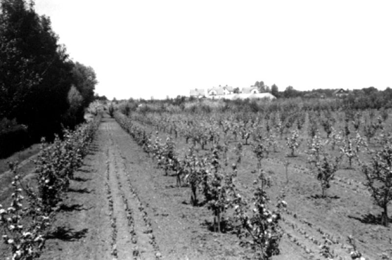
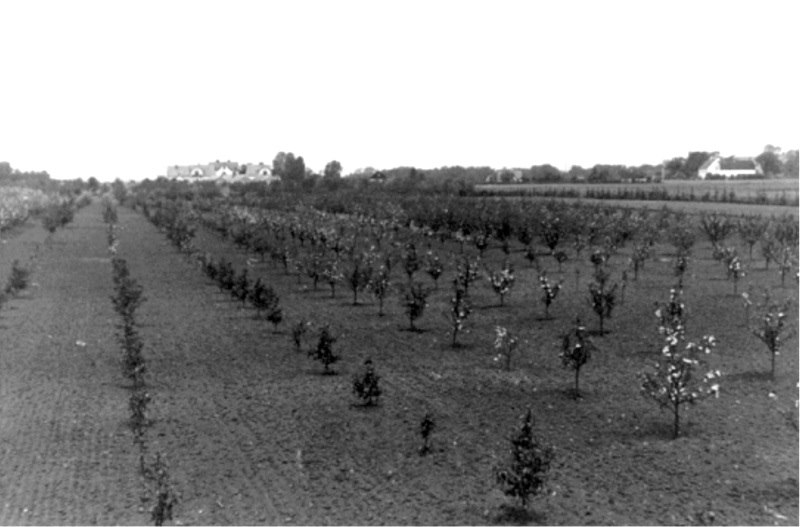
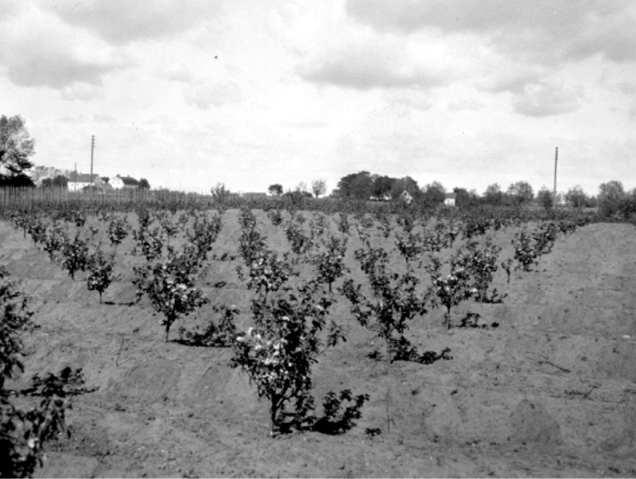
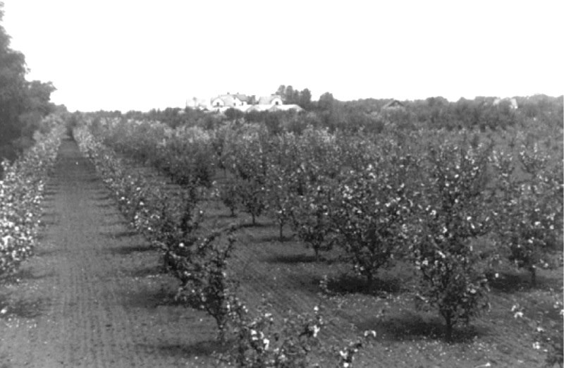
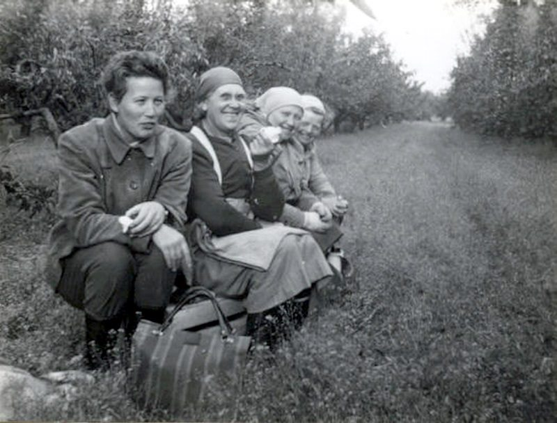
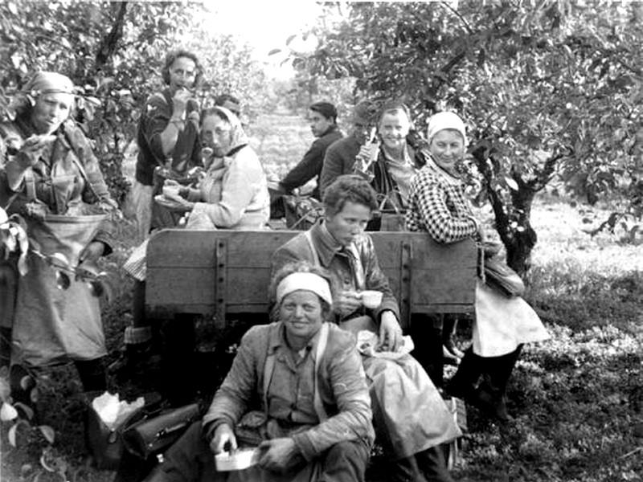
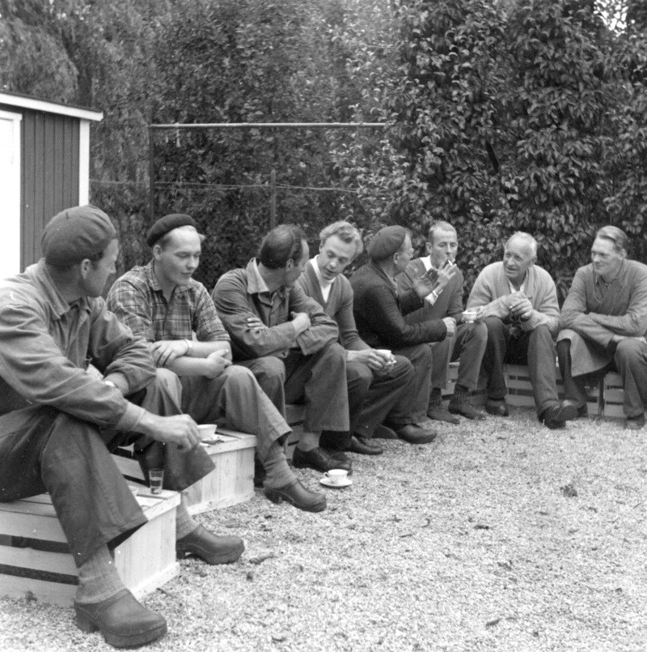
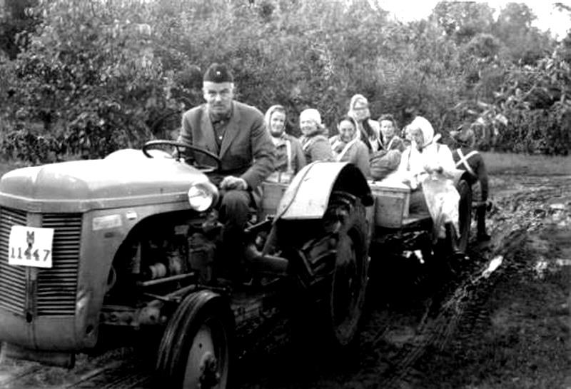
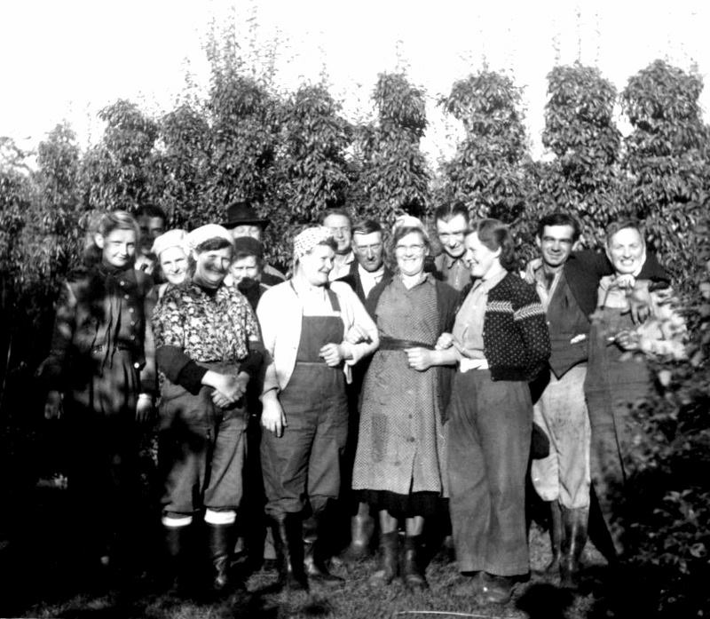
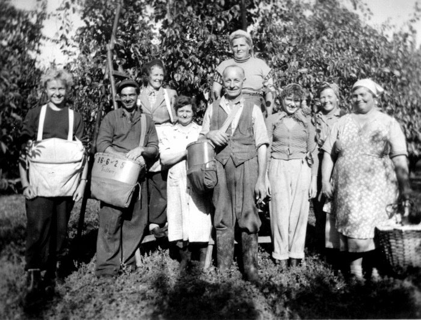
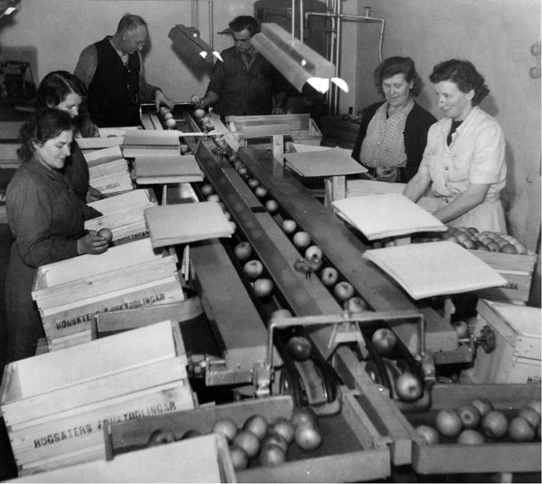
Äppelsorteringsmaskin

## Källor

* <https://www.facebook.com/groups/329822347104603/posts/2952430254843786/>
