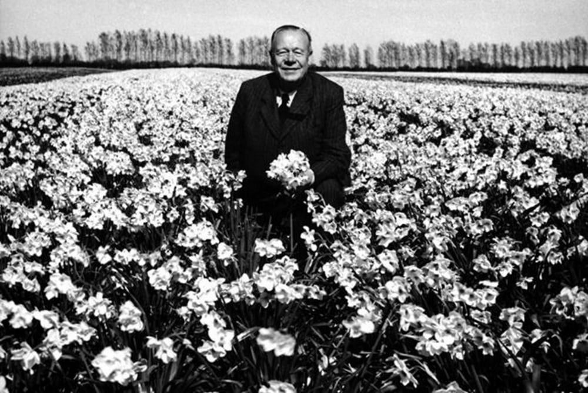
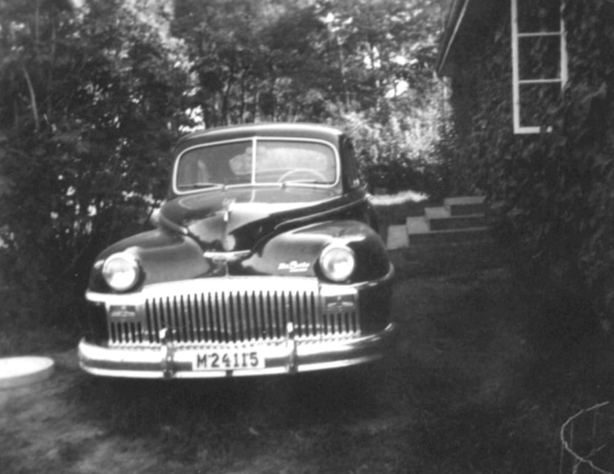

# Knut Gyllin

**Knut Gyllin** ([1883](1883.md)-[1963](1963.md)) var en [person](person.md) från familjen [Gyllin](Gyllin.md). Gift med [Emma Gyllin](Emma Gyllin.md). Han köpte gården [Löddesnäs gård](Löddesnäs gård.md) i [Löddesnäs](Löddesnäs.md).

De fick barnen:

* Ragnar (1912-1988)
* Verner (1914-2003)
* Arnold (1917-1994)
* Stellan (1919-1993)
* Rolf (1922-1979)
* Elna (1927-1958)
* Sigrun (1933-1986)

Han var en duktig rosenodlare och hade växthus i [Kvarnby](Kvarnby.md) som var ett tunnland stora.

Han födde även upp ardennerhästar och ponnyhästar. Han förädlade lökväxter: tulpaner, narcisser och påskliljor för lökarnas skull. Forsythia och Mahonia till snitt och kransar.

Han hade även försöksodlingar med rågvete och luzern, och på våren och sommaren var fälten fulla av färgrika blommor. Till gården fanns en vacker park med tre karpdammar.

1939 när Gyllin köpte gården var det krig och stor bränslebrist. Han högg då ner strandskogen. som [Professor Trägårdh](Professor Trägårdh.md) lät plantera ca. 1884.

Han använde detta till bränsle i växthusen i Kvarnby.

Han lät sätta upp stängsel runt ägorna och förbjöd obehöriga att vistas på gården.

Detta var inte omtyckt av Borgebyborna, som förut fick ströva omkring på gården och bada i Öresund.

Gyllins De Soto 1948 års modell.
Lån av Nils Nilsson Bjärred.  

Arbetare i vagnsporten Stellan Gyllin längst till vänster.
Lån av John Andersson Borgeby.

Knut Gyllin i Narcissodlingar på 1950-talet.

Foton från [Borgeby Kulturhistoriska Forskarlags Arkiv](Borgeby Kulturhistoriska Forskarlags Arkiv.md) och med tillstånd för Publicering.

## Bilder

