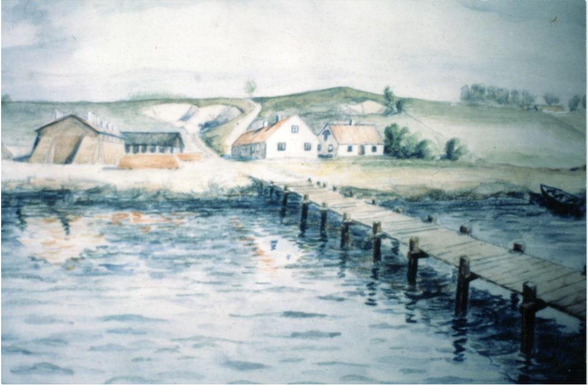

# Kolabryggan

**Kolabryggan** vid [Bjersunds tegelbruk](Bjersunds%20tegelbruk.md) lär ha varit en av de första badbryggorna (se: [brygga](brygga.md)) i [Bjärred](Bjärred.md). Det var bryggan där [pråm](pråm.md)arna med kolstybb till tegelbruket lade till. Den revs så småningom när tegelbruket lagts ner [1887](1887.md) och en ny brygga byggdes.

På CG Lekholms akvarell syns kolabryggan. I baggrund syns tegelbruket och [Långa längan](Långa%20längan.md) också.

## Källor

* <https://filer.hembygd.se/lomma/uploads/files/2021/06/03/Badlivet%20i%20Bjerred.pdf>
