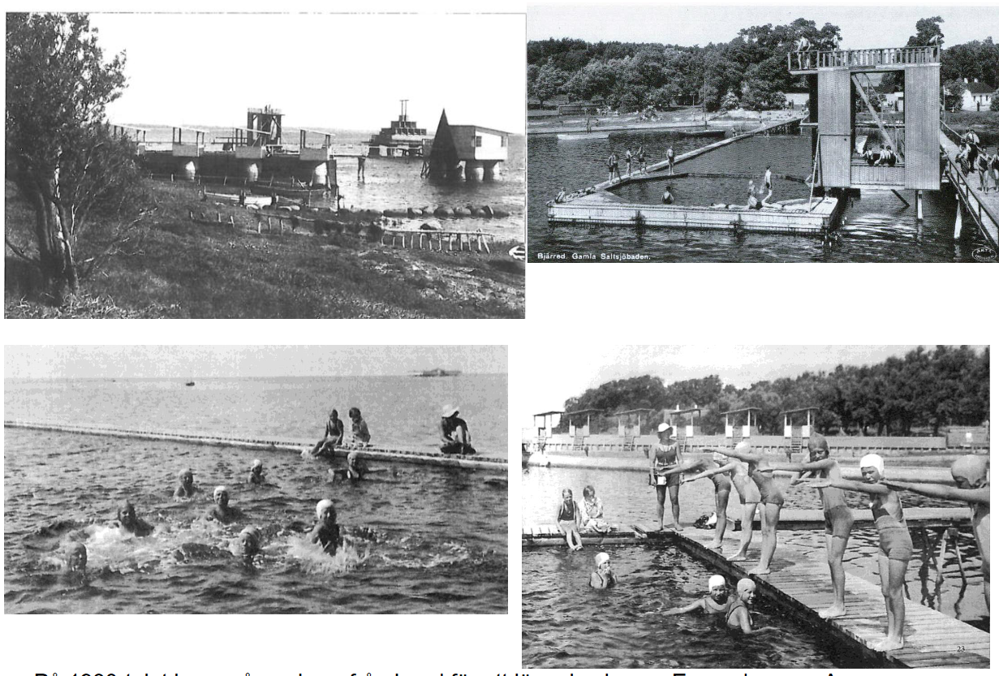
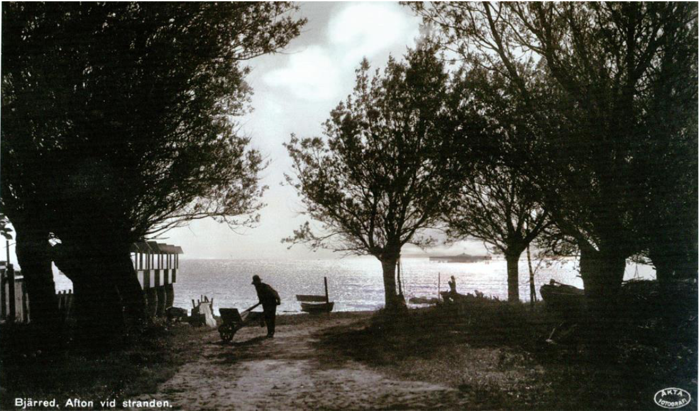

# Lycksalighetens ö

**Lycksalighetens ö**, ibland kallat "[[Gamla saltsjöbaden]]", byggdes år [[1922]] ca 100 meter norr om Anders Jönssons badbrygga och söder om [[Bjärreds saltsjöbad]].

Anläggningen anlades av bryggaren [[Axel Andersson]] i Lund. Den byggdes på tomma öltunnor fyllda med sand. Här fanns två simbassänger, en som var 25 meter lång och en mindre och fyrkantig – 4 m djup. Vid den senare fanns också ett högt hopptorn. Det fanns även ett soltorn, byggt i fyrkant, så man kunde flytta sig runt under dagen. Överst fanns romerska ringar.

Från [[1930]]-talet fanns här simskola på sommaren. På 1930-talet kom många barn från [[Lund]] för att lära sig simma.

En av dem var Arne:

> ”På stranden lärde vi oss torrsim, innan vi fick hoppa i den stora bassängen. Det var mycket roligt. Allt är nu borta, men minnet av dessa simdagar lever kvar”.

Isen skruvade sönder alltihop vintern [[1941]]/[[1942]].

## Bilder

Längst ned till vänster kan man se [[Bjärreds saltsjöbad]] i bakgrunden.

Till vänster syns Lycsalighetens ö. Till höger syns Bjärreds saltsjöbad.
