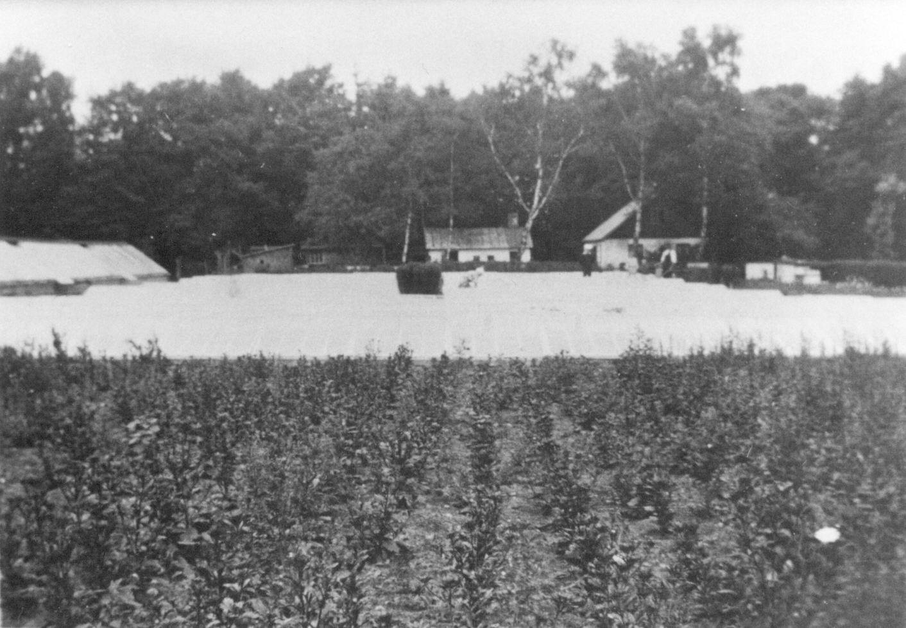
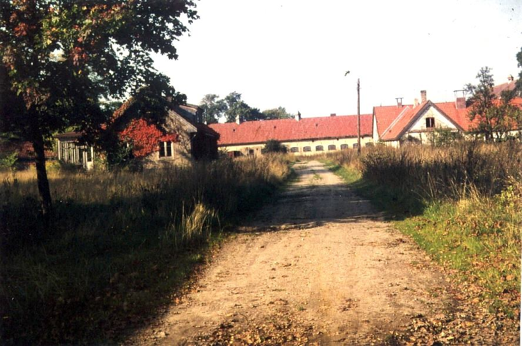
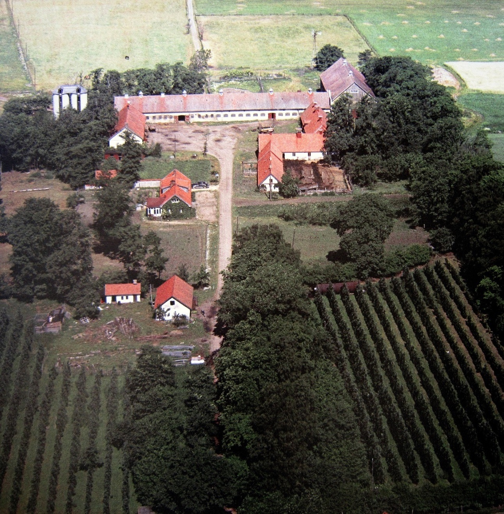

# Löddesnäs gård

**Löddesnäs gård** var en [gård](gård) i [Löddesnäs](Löddesnäs) i [Bjärred](Bjärred). Den låg på samma plats där [Löddesnässkolan](Löddesnässkolan) ligger idag.

Gårdens jord tillhörde [Borgeby Slott](Borgeby%20Slott) som ägdes av von Ekensteen och Clausen.

Dessa sålde [1863](1863) till Conrad Crafoord som sålde till Professor Gustaf Trägårdh. Trägårdh började bebygga gården. Han byggde inspektorsbostad [1865](1865)-70 och mangårdsbyggnad [1868](1868).

Omkring [1887](1887) köpte professor Hjalmar Lindgren gården på auktion. Hans dotter Nanna Elisabeth Lindgren ärvde gården 1919. Hon var gift med Professor Frans Wilhelm Törne.

Törne, Trägårdh, Lindgren och Törne hade alla Löddesnäs som fritidsbostad. [1938](1938) (eller [1939](1939)?) sålde Törne gården till [Knut Gyllin](Knut%20Gyllin). [1963](1963)-[1966](1966) var ägarna Knut Gyllins sterbhus.

Till gården fanns en vacker park med två karpdammar.

## Bilder

