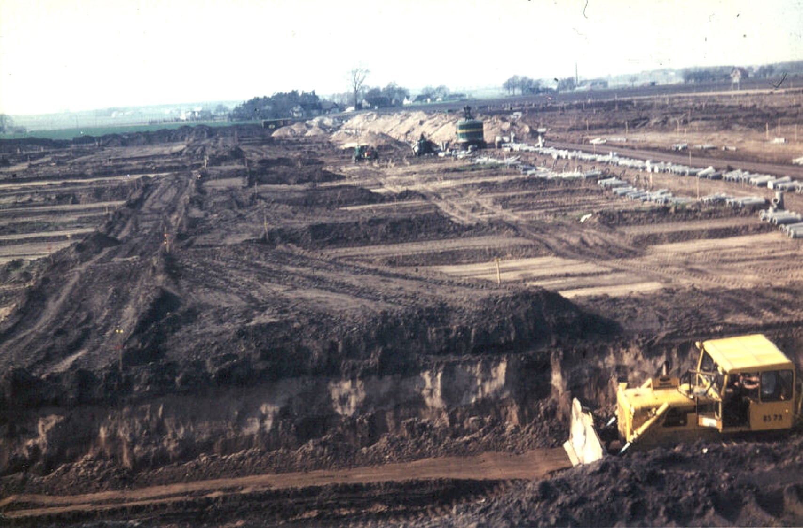

# Löddesnäs

**Löddesnäs** är ett [område](område) i [Bjärred](Bjärred). Området byggdes på [1960](1960)-talet. [Löddesnäs gård](Löddesnäs%20gård) låg där [Löddesnässkolan](Löddesnässkolan) byggdes sedan.

Fram till skiftet på 1860-talet var Löddesnäs betesmark. [Knut Gyllin](Knut%20Gyllin) odlade blommer på området vid Löddesnäs under 1900-talet.

[1966](1966) köpte Lomma kommun hela Löddesnäs och bebyggelsen började växa fram. Sedan revs dåvarende byggnaderna (inklusive gården) och Löddesnässkolan uppfördes på stället.

## Bilder

Löddesnäs under uppbyggnad på 1960-talet.

## Referenser till denna artikel

* [Gyllins ängar](Gyllins%20ängar)
* [Knut Gyllin](Knut%20Gyllin)
* [Löddesnäs gård](Löddesnäs%20gård)
* [löddesnässkolan](löddesnässkolan)
