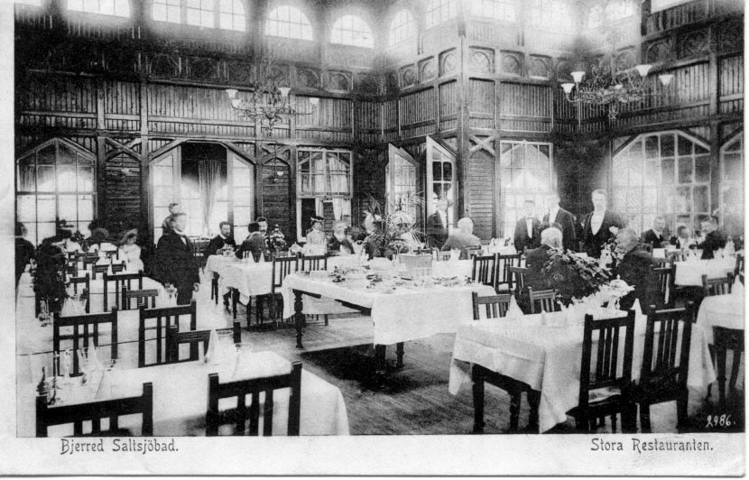

# Restaurangen vid Bjärreds saltsjöbad

**Restaurangen vid Bjärreds saltsjöbad** var en [restaurang](restaurang) i [Bjärred](Bjärred) som tillhörde vid [Bjärreds saltsjöbad](Bjärreds%20saltsjöbad).

## Uppdelning

Tydligen fanns där även en uppdelning sådan att det fanns två Restauranger, en första klass och en andra klass. Den förstklassiga, med frackklädda Kypare och Hovmästare, lockade de lite ”finare” gäster.

## Gäster

Hit till Bjärreds Saltsjöbad kom Borgerskapet, dvs. Industri-Affärs och Handelsmän samt Akademiker. De flesta kom från Lund med Bjärreds-banan, men också Malmös Borgerskap sökte sig hit.

## Mat

Varje dag serverades kall kokt lax, skinka i madeirasås, färska bjerredssparris m.m. Barnen uppskattade speciellt glassen som var en sällsynt läckerhet på den tiden. Det fanns ju inte frysskåp, så man fick såga upp isen på vintern och lagra den under sommaren i sågspån. Den kom från Ringsjön och ibland från Småland.

## Underhållning

Efter middagen kunde man lyssna till musikunderhållning eller bara njuta utsikten över Öresund. Det fanns många andra förströelser, tennis, krocket kägelspel, boccia och
kanske en liten segeltur.

## Ägare

Restaurangen drevs av [Moje Björkman-Junggren](Moje%20Björkman-Junggren).

## Brand

Tyvärr brann den år [1950](1950) ned (se [Branden i Bjärreds saltsjöbad](Branden%20i%20Bjärreds%20saltsjöbad)).

En ny restaurang byggdes men den brann också på [1960](1960)-talet.

## Idag

Idag finns där bara en [parkeringsplats](parkeringsplats) på platsen där den låg.

## Bilder

Restaurangens eleganta Matsal med frackklädda Kypare och Hovmästare 1901.
