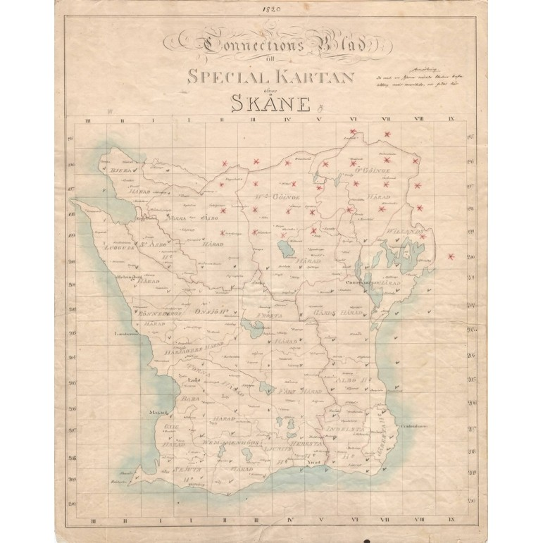

# Skånska rekognosceringskartan

Den **skånska rekognosceringskartan** var ett karteringsprojekt som pågick från [1812](1812) till [1820](1820). Det var den första systematiska topografiska karteringen av Sverige och utfördes av fältmätningsbrigaden. Kartorna framställdes i skala 1:20 000 och omfattar större delen av Skåne.

Syfte att göra en mer vetenskaplig kartering av Sverige byggd på geodetiska mätpunkter och triangulering började man med Skåne 1812. Man handritade i skala 1:20.000. 1821 fick man acceptera att vald metod och skala var för ambitiös och skulle ta årtionden att färdigställa. Rekognosceringsverket avslutades till förmån för generalstabskartan i skala 1:100000.

Skälet till att kartera Skåne för militära ändamål var hotet från Napoleon på kontinenten - och Skåne var således det ställe som först skulle kunna bli angripet.

## Bilder

## Källor

* <https://sok.riksarkivet.se/Home/?postid=Arkis+30c3c29b-cbdb-479a-b715-9102997bdd90&flik=1&s=Balder>
* <https://www.lansstyrelsen.se/skane/samhalle/kulturmiljo.html>
* <https://sv.wikipedia.org/wiki/Sk%C3%A5nska_rekognosceringskartan>

## Referenser till denna artikel
- [1812](1812)
- [1820](1820)
