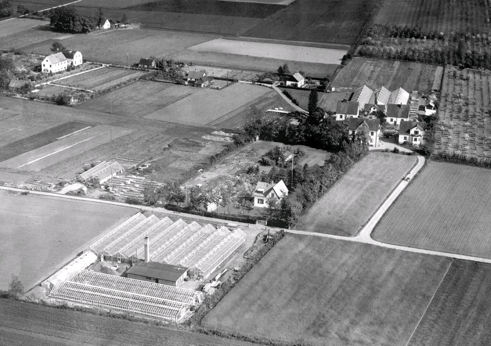

# Beatenborg

**Beatenborg** var en [bostad](bostad) i [Bjerehof](bjerehof) en gång tillhörande [Walter Reeder](walter%20reeder) och döpt efter hans dotter [Beata](beata).

Beatenborg ligger längst av husen ner på bilden, nära växthusen.

## Referenser till denna artikel

* [Bjerehof](bjerehof)
* [Flädie 15,7](flädie%2015,7)
