# Bjärreds järnvägsstation

**Bjärreds järnvägsstation** var en [järnvägsstation](järnvägsstation) för [järnväg](järnväg)en mellan [Lund](lund) och [Bjärred](bjärred).

BLHJ: Bjärred-Lund-Harlösa. Banan Lund-Bjärred börjades byggas [1899](1899) och öppnades den 26 juli [1901](1901) och lades ner [1939](1939). Den officiella invigningen var den 27 augusti 1901. Bygget blev delvis finansierat genom aktieteckning som till slut gav 250.000 kr.

Från början fanns ett provisoriskt stationshus som sedan flyttades till [Leråkra](leråkra). Stationsbyggnaden ritades av Domkyrkoarkitekten Theodor Wåhlin. [1928](1928) tillbyggdes en del, för Posten och för Televerkets telefon och telegrafstation.

Banan elektrifierades år [1916](1916). Vid Leråkra fanns ett anslutningsspår till [Flädie](flädie). Stationerna ritades av Theodor Wåhlin i trä i en roman­tise­rande panel­arkitektur. Stationer i dagens Lomma kommun: Fjelie; Leråkra; Bjärred och en hållplats vid Kaniks tegelbruk.

Sträckan byggdes och ägdes av Aktiebolaget "Lund-Bjerreds Spårvägsaktiebolag".I Bjärred fanns ingen vändplatta så tåget fick backa tillbaka. Den planerade kostnaden var ca. 410.000 kr men den faktiska kostnaden blev 816.800 kr. Banan gick med ständigt ökande förlust och redan efter 10 år tog Lunds stad över driften. Samtidigt tog Lund också över driften av linjen Lund-Harlösa. De båda linjerna förenades och blev en linje 1918. En varm sommarsöndag kunde upp till 5000 personer ta tåget till Bjärred. Resan tog 25 minuter. 1916 elektrifierades banan med förhoppning att göra linjen lönsam. Sommartrafiken var visserligen intensiv, men vintern medförde stora förluster. När man 1937 summerade ekonomin, fann man att banan kostat Lunds innevånare mer än 6 miljoner skattekronor. Det beslöts då att lägga ner Banan. 1939 gick sista persontåget och rälsen revs upp.

Byggnaden står dock kvar och har under åren använts till [Busstation](busstation), Post och Telestation och såldes i början av 1970-talet till Lomma Kommun som använde den till bl.a. Ungdomsgård och Fritidsverksamhet.

Fram till år 1955 använde SJ spårsträckan Fjelie – Flädie till att köra betor på.

## Bilder

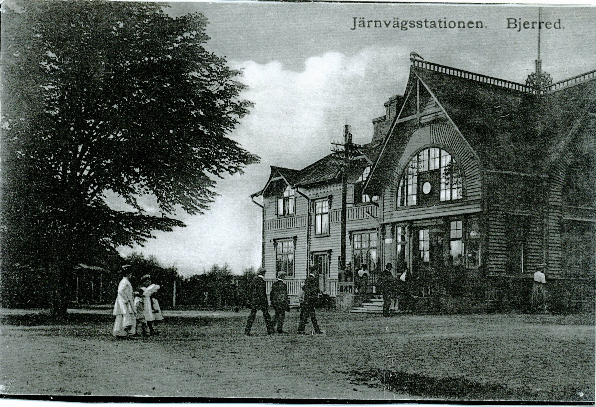

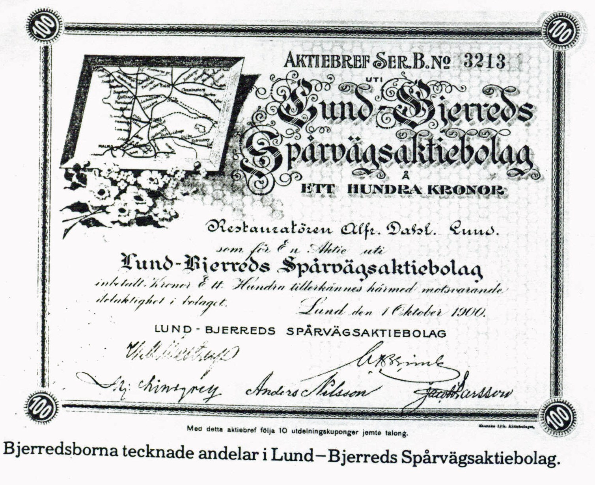

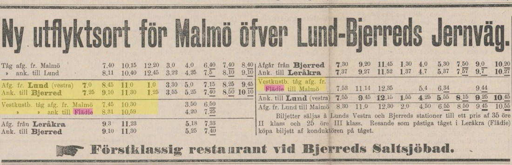

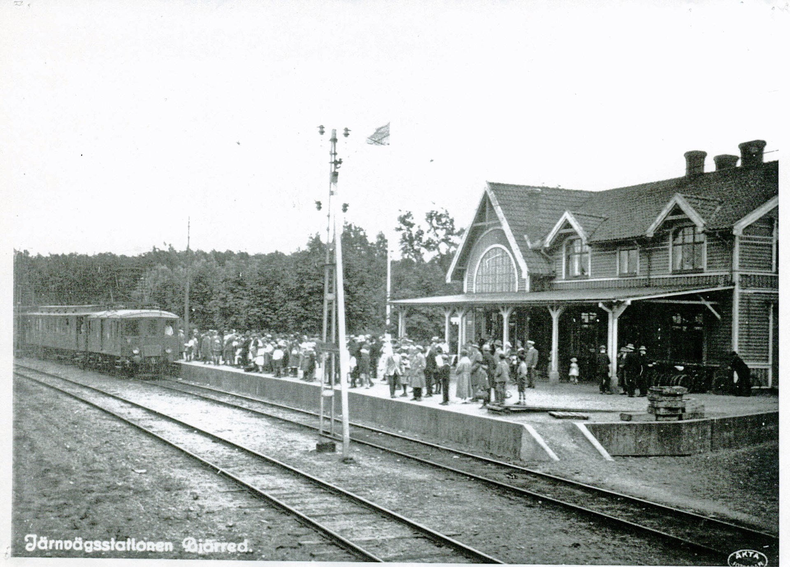

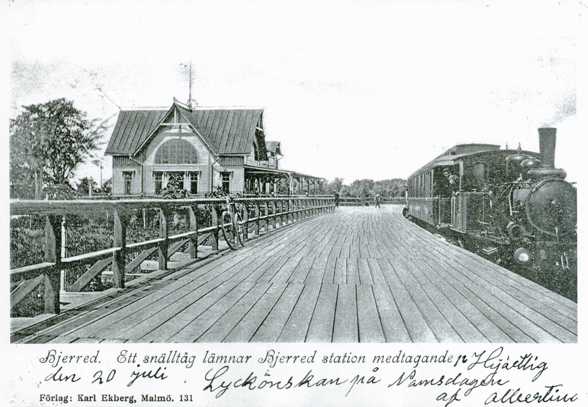

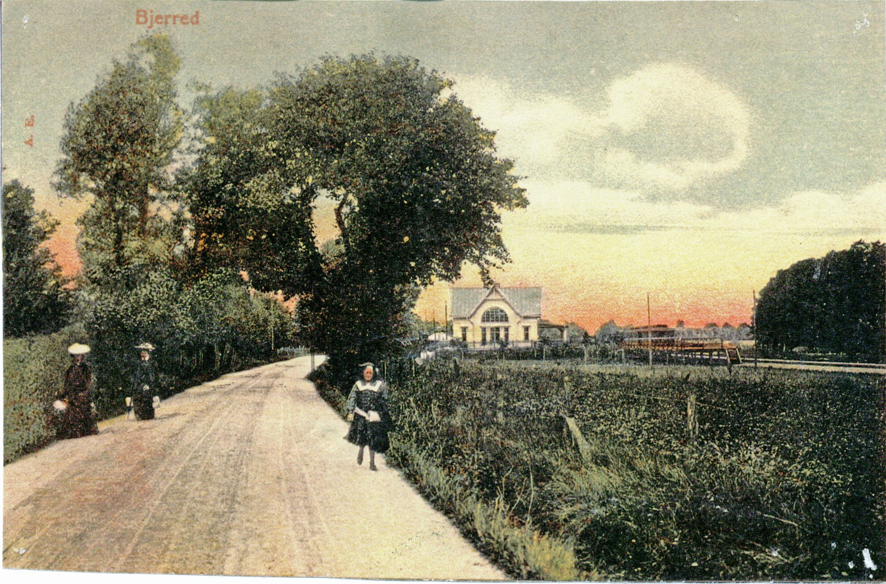

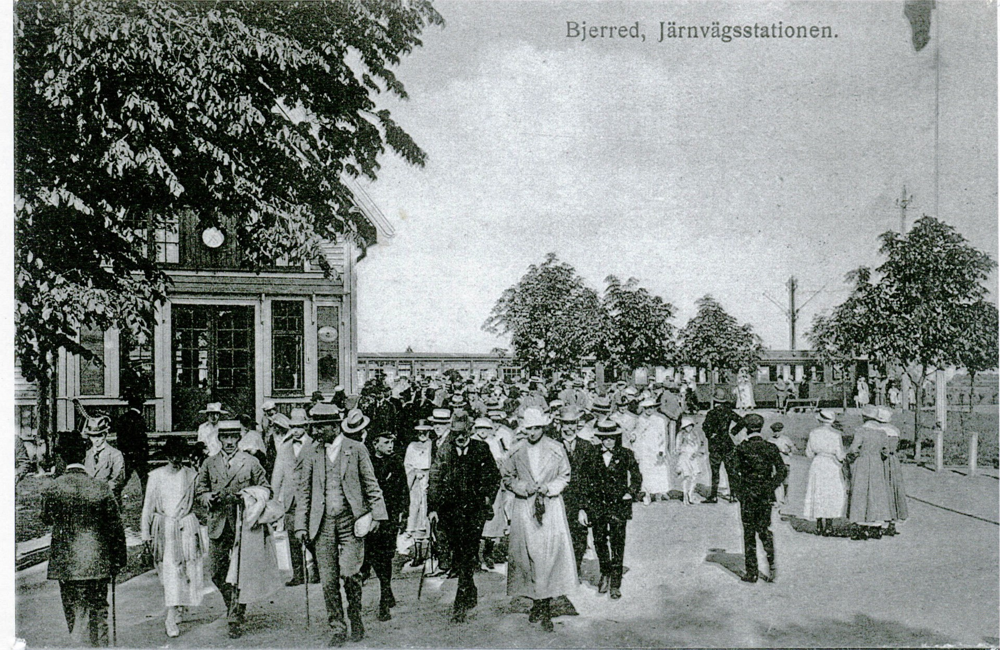

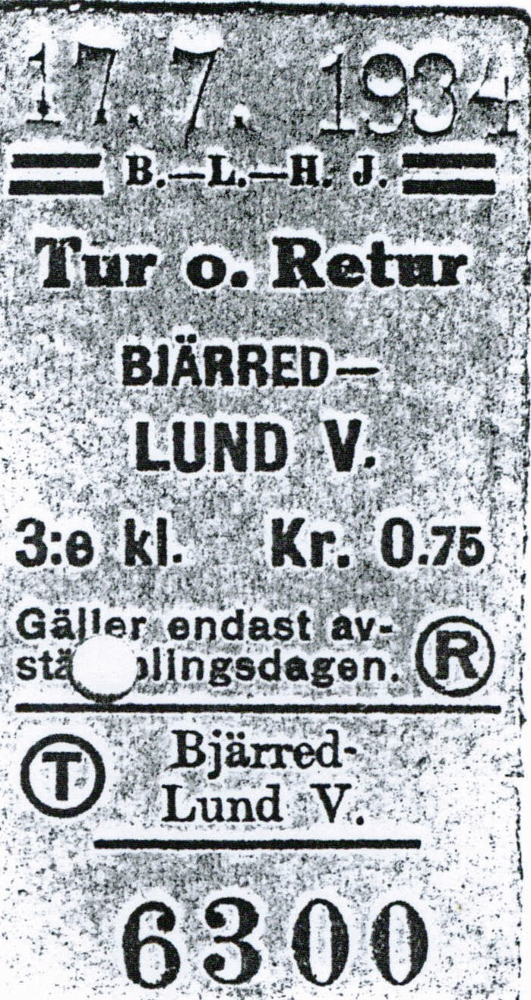

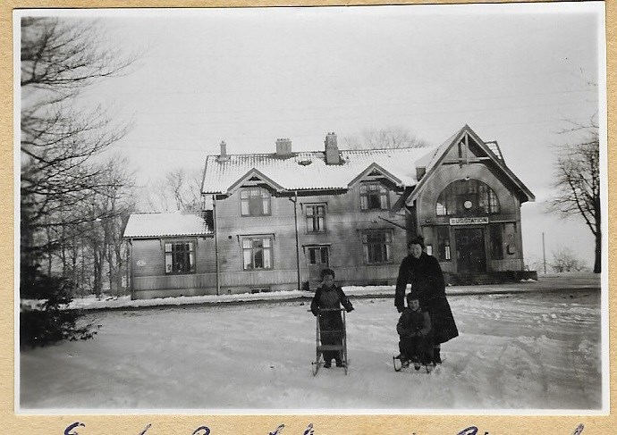

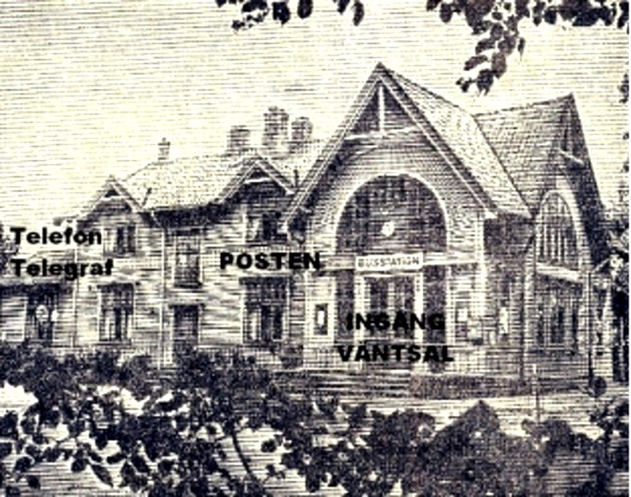

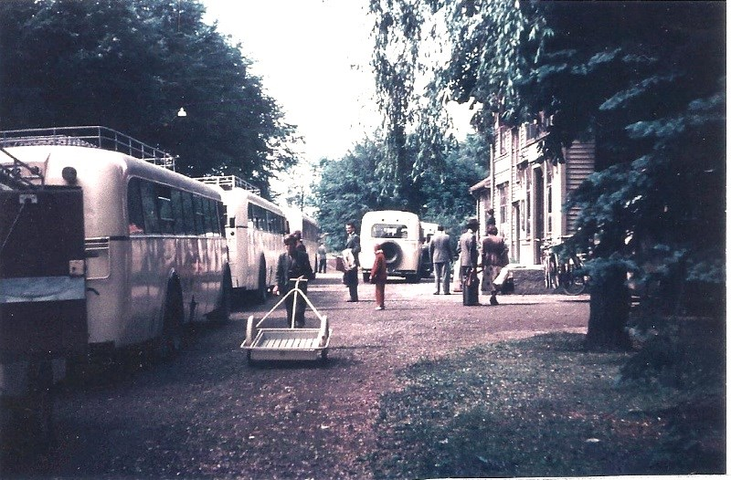

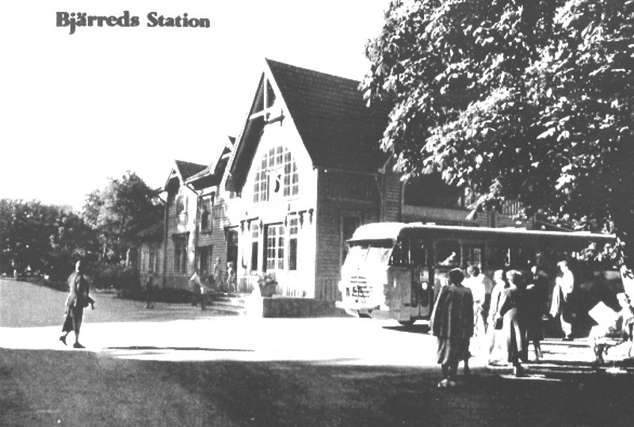

## Källor

* <https://www.hembygd.se/lomma/plats/175909/gallery/2649843>

## Referenser till denna artikel

* [Bjärred-Lund-Harlösa Järnvägar](bjärred-lund-harlösa%20järnvägar)
* [Bjärreds saltsjöbad](bjärreds%20saltsjöbad)
* [Järnväg](järnväg)
* [Järnvägsstation](järnvägsstation)
* [Ånglok](ånglok)
