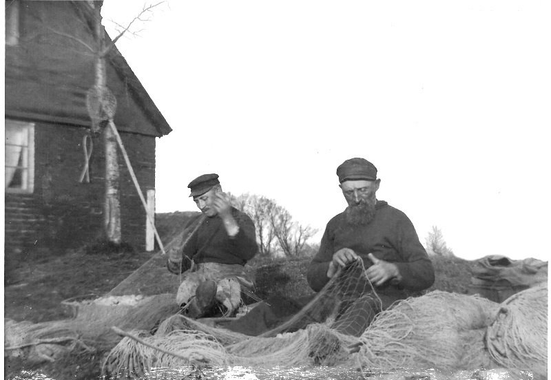

# Flädie 11,20 Strandvägen 3

Vid utskiftningen under 1800-talet byggdes ett antal fiskarstugor vid nuvarande Strandvägen på Flädie Nr 11 som var ett gammalt Domkyrkohemman.
Båtförare, Sjöman och Speleman Nils Nilsson (1848-1936) i Flädie
gift 1874.09.11. med Anna Hansdotter (1851- 1932) bodde här.
De fick Barnen:
Carl (1874-1961), Bothilda (1876-1964) Johanna (f.1878), Olof (1880-1889), Betty (f.1882),
Frans (1884-1983), Elof (1886-1976), Kerstin (f. 1889), Nina (1891-1897), Olof (f. 1893)
och Elfva (1895-1973) alla födda i Flädie 11.
Dottern Elfva (1895-1973) och Henning (1886-1965) Larsson övertog huset efter föräldrarna.
1973 övertog deras son Lennart (f.1934) och Ingrid (f.1938) Larsson.
De klädde huset med tegel.
6A. Nils Nilsson (1848-1936) och sonen Frans (1884-1983)lagar näten.
Lån av Lennart och Ingrid Larsson Bjärred.
7A. Nils Nilsson (1848-1936) och sonen Frans (1884-1983)har garnarbete.
Lån av Lennart och Ingrid Larsson Bjärred.
8A. Släktträff vid stranden i Bjärred ca.1915
Fr.v. Bak: Nils Nilsson, Göta Högström (1897-1986), Anna Nilsson och Elfva.
Fr.v. Framme Adolf och Tilda Högström, Kerstin Hemberg 26 år,
Sixten och Erik Hemberg, Emil Hemberg och Frans Nilsson.
Foto Foto: ”Alfred Hagbloms Foto” Lund. Lån av Lennart och Ingrid Larsson Bjärred.
3B. Nils Nilssons son Frans (1884-1983)var också Fiskare.
Lån av Lennart och Ingrid Larsson Bjärred.
Foton från Benny Nilssons arkiv och med tillstånd för Publicering.

## Se även

* [Flädie 11](flädie%2011)

## Bilder

